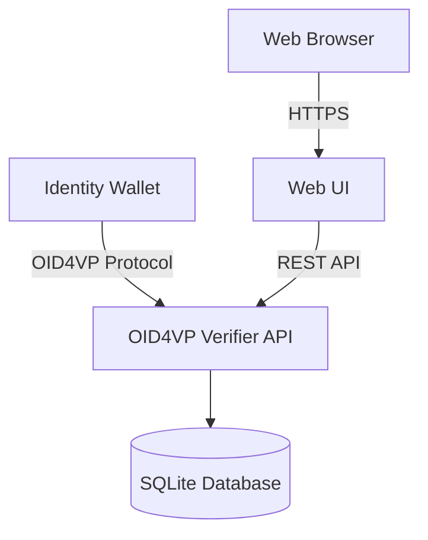

# OWND-Project-VP

OpenID for Verifiable Presentations (OID4VP) プロトコルに準拠したVerifier実装です。Identity Walletから提示されるVerifiable Credentials (VC) を要求・検証する機能を提供します。

## 概要



## 主な機能

- **OID4VP プロトコル準拠**: Authorization Request生成、VP Token検証
- **DCQL (Digital Credentials Query Language)**: クレデンシャル要求の柔軟な定義
- **SD-JWT対応**: Selective Disclosure JWTの処理
- **X.509証明書検証**: x5cヘッダーによる証明書チェーン検証
- **Web UI**: クレーム選択、QRコード表示、検証結果表示

## ドキュメント

| ドキュメント | 説明 |
|-------------|------|
| [アーキテクチャ](./docs/architecture.md) | システム構成、レイヤー構造 |
| [デプロイメントガイド](./docs/deployment.md) | 環境設定、デプロイ手順 |
| [API仕様](./docs/api-specification.md) | REST APIエンドポイント |
| [OID4VP実装](./docs/oid4vp-implementation.md) | OID4VPプロトコル実装詳細 |

## クイックスタート

### 必要条件

- Node.js 20以上

### インストール

```bash
npm install
```

### ビルド

```bash
npm run build
```

### 実行

```bash
# 開発環境
npm run dev

# 本番環境
NODE_ENV=production npm start
```

### 環境設定

環境変数の詳細な設定方法については[デプロイメントガイド](./docs/deployment.md)を参照してください。

## ライセンス

このプロジェクトはMITライセンスの下で公開されています。
