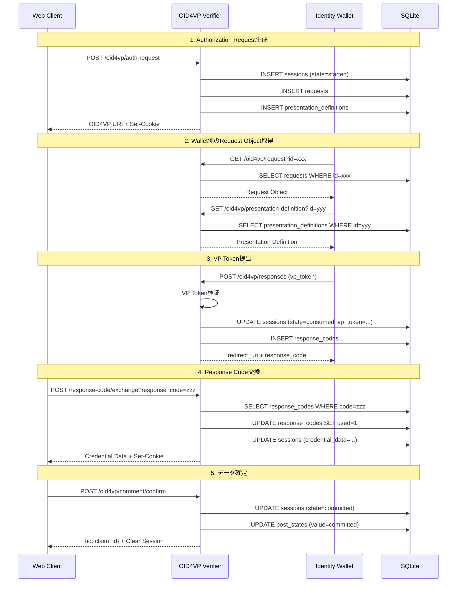

# OID4VP Verifier - API仕様ドキュメント

## 概要

OID4VP VerifierシステムはOpenID for Verifiable Presentations (OID4VP) プロトコルに準拠した純粋なVerifierとして実装されています。このドキュメントでは、各APIエンドポイントの仕様、リクエスト/レスポンス形式、エラーハンドリング、認証方法について詳述します。

## システム構成

| 構成要素 | ベースパス | 公開API | CORS設定 |
|---------|-----------|---------|---------|
| OID4VP Verifier | `http://localhost:3000` | OID4VP API | 特定オリジンからのGET/POST、credentials有効 |

## OID4VP API

OID4VP APIは、OpenID for Verifiable Presentationsプロトコルを実装し、Identity Walletとの連携を提供します。

### Base URL

- `http://localhost:3000/oid4vp`

---

## エンドポイント一覧

### 1. Authorization Request生成

#### POST /oid4vp/auth-request

Verifiable Presentationをリクエストするための認証リクエストを生成します。

**リクエスト**:

```http
POST /oid4vp/auth-request HTTP/1.1
Content-Type: application/json

{
  "type": "post_comment",
  "url": "https://example.com/article/123"
}
```

**リクエストボディ**:

| フィールド | 型 | 必須 | 説明 |
|-----------|---|------|------|
| `type` | string | - | リクエストタイプ（デフォルト: `"post_comment"`） |
| `url` | string | - | 対象URL（typeによっては必須） |

**レスポンス** (200 OK):

```json
{
  "value": "oid4vp://example.com/request?client_id=http://localhost:3000&request_uri=http://localhost:3000/oid4vp/request%3Fid%3Dreq_abc123%26presentationDefinitionId%3Dpd_xyz789"
}
```

**レスポンスボディ**:

| フィールド | 型 | 説明 |
|-----------|---|------|
| `value` | string | OID4VP URIスキームのAuthorization Request URL |

**セッション**:

- セッションCookieに`request_id`を設定
- `transaction_id`が存在する場合は設定

**エラーレスポンス**:

| ステータス | エラータイプ | 説明 |
|-----------|-------------|------|
| 400 | `INVALID_PARAMETER` | リクエストボディが不正 |

**処理フロー**:
1. Presentation Definitionを生成
2. リクエストIDをSQLiteのsessionsテーブルに保存（状態: `started`）
3. Authorization Requestを生成
4. セッションに`request_id`を設定
5. OID4VP URIを返却

---

### 2. Request Object取得

#### GET /oid4vp/request

Identity Walletが使用するRequest Objectを取得します。

**リクエスト**:

```http
GET /oid4vp/request?id=req_abc123&presentationDefinitionId=pd_xyz789 HTTP/1.1
```

**クエリパラメータ**:

| パラメータ | 型 | 必須 | 説明 |
|-----------|---|------|------|
| `id` | string | ✓ | リクエストID（UUIDv4） |
| `presentationDefinitionId` | string | ✓ | Presentation Definition ID |

**レスポンス** (200 OK):

```json
{
  "response_type": "vp_token",
  "response_mode": "direct_post",
  "response_uri": "http://localhost:3000/oid4vp/responses",
  "client_id": "http://localhost:3000",
  "nonce": "n-0S6_WzA2Mj",
  "state": "req_abc123",
  "presentation_definition": {
    "id": "pd_xyz789",
    "input_descriptors": [...]
  }
}
```

**レスポンスボディ**:

OID4VP Request Object（詳細は[OID4VP仕様](https://openid.net/specs/openid-4-verifiable-presentations-1_0.html)を参照）

**エラーレスポンス**:

| ステータス | エラータイプ | 説明 |
|-----------|-------------|------|
| 400 | `BAD_REQUEST` | クエリパラメータが不正 |
| 404 | - | リクエストが見つからない |

---

### 3. Presentation Definition取得

#### GET /oid4vp/presentation-definition

Presentation Definitionを取得します。

**リクエスト**:

```http
GET /oid4vp/presentation-definition?id=pd_xyz789 HTTP/1.1
```

**クエリパラメータ**:

| パラメータ | 型 | 必須 | 説明 |
|-----------|---|------|------|
| `id` | string | ✓ | Presentation Definition ID |

**レスポンス** (200 OK):

```json
{
  "id": "pd_xyz789",
  "input_descriptors": [
    {
      "id": "id_token_input",
      "format": {
        "jwt_vc_json": {
          "proof_type": ["JsonWebSignature2020"]
        }
      },
      "constraints": {
        "fields": [
          {
            "path": ["$.type"],
            "filter": {
              "type": "string",
              "pattern": "^VerifiableCredential$"
            }
          }
        ]
      }
    }
  ]
}
```

**レスポンスボディ**:

[DIF Presentation Exchange](https://identity.foundation/presentation-exchange/)仕様準拠のPresentation Definition

**エラーレスポンス**:

| ステータス | エラータイプ | 説明 |
|-----------|-------------|------|
| 404 | `NOT_FOUND` | Presentation Definitionが見つからない |

---

### 4. Authorization Response受信

#### POST /oid4vp/responses

Identity WalletからVerifiable Presentationを受信します（Response Endpoint）。

**リクエスト**:

```http
POST /oid4vp/responses HTTP/1.1
Content-Type: application/x-www-form-urlencoded

vp_token=eyJhbGciOiJFUzI1NiIsInR5cCI6IkpXVCJ9...&presentation_submission=%7B%22id%22%3A%22sub123%22%7D&state=req_abc123
```

**リクエストボディ** (application/x-www-form-urlencoded):

| フィールド | 型 | 必須 | 説明 |
|-----------|---|------|------|
| `vp_token` | string | ✓ | VP Token（JWT形式またはSD-JWT形式） |
| `presentation_submission` | string | ✓ | Presentation Submission（JSON文字列） |
| `state` | string | ✓ | リクエスト時のState値（`request_id`） |

**レスポンス** (200 OK):

```json
{
  "redirect_uri": "https://client.example.org/cb#response_code=091535f699ea575c7937fa5f0f454aee"
}
```

**レスポンスボディ**:

| フィールド | 型 | 説明 |
|-----------|---|------|
| `redirect_uri` | string | クライアントへのリダイレクトURI（レスポンスコード含む） |

**検証処理**:
1. VP Tokenの署名検証（JWS/JWT）
2. X.509証明書チェーン検証（x5cヘッダーがある場合）
3. Presentation Submissionの検証
4. Descriptor Mapとの整合性検証
5. ネストされたCredentialの検証
6. セッション状態を`consumed`に更新
7. レスポンスコードを生成してresponse_codesテーブルに保存

**エラーレスポンス**:

| ステータス | エラータイプ | 説明 |
|-----------|-------------|------|
| 400 | `INVALID_PARAMETER` | リクエストボディが不正 |
| 400 | `INVALID_SUBMISSION` | Presentation Submissionが不正 |

**環境変数**:

- `OID4VP_VERIFIER_AUTH_RESPONSE_LIMIT`: リクエストボディサイズ制限（デフォルト: 1mb）

---

### 5. Response Code交換

#### POST /oid4vp/response-code/exchange

レスポンスコードを交換してクレデンシャルデータを取得します。

**リクエスト**:

```http
POST /oid4vp/response-code/exchange?response_code=091535f699ea575c7937fa5f0f454aee HTTP/1.1
Cookie: koa.sess=...
```

**クエリパラメータ**:

| パラメータ | 型 | 必須 | 説明 |
|-----------|---|------|------|
| `response_code` | string | ✓ | レスポンスコード（UUID） |

**レスポンス** (200 OK):

```json
{
  "url": "https://example.com/article/123",
  "claimer": {
    "id_token": "eyJhbGciOiJFUzI1NiIsInR5cCI6IkpXVCJ9...",
    "sub": "user@example.com",
    "icon": "https://example.com/icon.png",
    "organization": "Example Org"
  },
  "comment": "eyJhbGciOiJFUzI1NiIsInR5cCI6IkpXVCJ9..."
}
```

**レスポンスボディ**:

レスポンスボディはリクエストタイプによって異なります。上記は`post_comment`タイプの例です。

**セッション**:

- セッションCookieに`request_id`を設定
- セッション状態を`consumed`に更新

**処理フロー**:
1. レスポンスコードの有効性確認（response_codesテーブル）
2. レスポンスコードを使用済みに設定（used=1）
3. VP Tokenからクレデンシャルデータを抽出
4. データをsessions.credential_dataに保存
5. クレデンシャルデータを返却

**エラーレスポンス**:

| ステータス | エラータイプ | 説明 |
|-----------|-------------|------|
| 400 | `INVALID_PARAMETER` | レスポンスコードが不正 |
| 404 | - | レスポンスコードが見つからない |
| 410 | `EXPIRED` | レスポンスコードが期限切れ |

---

### 6. コメント確定

#### POST /oid4vp/comment/confirm

検証済みクレデンシャルデータを確定します。

**認証**: セッションCookieに`request_id`が必要

**リクエスト**:

```http
POST /oid4vp/comment/confirm HTTP/1.1
Cookie: koa.sess=...
```

**レスポンス** (200 OK):

```json
{
  "id": "claim_abc123"
}
```

**レスポンスボディ**:

| フィールド | 型 | 説明 |
|-----------|---|------|
| `id` | string | 作成されたクレームID |

**セッション**:

確定後、セッションを無効化（`ctx.session = null`）

**処理フロー**:
1. セッションから`request_id`を取得
2. sessions.credential_dataからデータを取得
3. データを永続化（アプリケーション固有の処理）
4. セッション状態を`committed`に更新
5. セッションを無効化

**エラーレスポンス**:

| ステータス | エラータイプ | 説明 |
|-----------|-------------|------|
| 400 | `INVALID_HEADER` | セッションが不正 |
| 404 | - | セッションが見つからない |

---

### 7. コメントキャンセル

#### POST /oid4vp/comment/cancel

クレデンシャルデータの確定をキャンセルします。

**認証**: セッションCookieに`request_id`が必要

**リクエスト**:

```http
POST /oid4vp/comment/cancel HTTP/1.1
Cookie: koa.sess=...
```

**レスポンス** (204 No Content):

（ボディなし）

**処理フロー**:
1. セッション状態を`canceled`に更新
2. post_statesテーブルの状態を更新

**エラーレスポンス**:

| ステータス | エラータイプ | 説明 |
|-----------|-------------|------|
| 400 | `INVALID_HEADER` | セッションが不正 |
| 404 | - | セッションが見つからない |

---

### 8. 状態取得

#### GET /oid4vp/comment/states

現在のセッション状態を取得します。

**認証**: セッションCookieに`request_id`が必要

**リクエスト**:

```http
GET /oid4vp/comment/states HTTP/1.1
Cookie: koa.sess=...
```

**レスポンス** (200 OK):

```json
{
  "value": "consumed"
}
```

**レスポンスボディ**:

| フィールド | 型 | 説明 |
|-----------|---|------|
| `value` | string | 現在の状態値 |

**状態値一覧**:

| 値 | 説明 | データフロー |
|----|------|------------|
| `started` | 認証リクエスト生成済み | POST /auth-request完了 |
| `consumed` | レスポンスコード交換済み | POST /response-code/exchange完了 |
| `committed` | クレデンシャル確定済み | POST /comment/confirm完了 |
| `expired` | セッション期限切れ | 有効期限超過 |
| `canceled` | キャンセル済み | POST /comment/cancel実行 |
| `invalid_submission` | 無効な提出 | Presentation Submission検証失敗 |

**セッション**:

`value`が`"committed"`の場合、セッションを無効化

**エラーレスポンス**:

| ステータス | エラータイプ | 説明 |
|-----------|-------------|------|
| 400 | `INVALID_HEADER` | セッションが不正 |
| 404 | - | 状態が見つからない |

---

## 認証・認可

### セッション認証

OID4VP APIはCookie-basedセッション認証を使用します。

**セッション設定**:

```typescript
app.keys = [process.env.OID4VP_COOKIE_SECRET];
app.use(session({
  maxAge: 60 * 60 * 1000,  // 1時間
  signed: true,
  httpOnly: true,
  secure: NODE_ENV !== 'local',
  sameSite: 'none'
}, app));
```

**セッションフィールド**:

| フィールド | 型 | 説明 |
|-----------|---|------|
| `request_id` | string | リクエストID（UUIDv4） |
| `transaction_id` | string | トランザクションID（オプション） |

**対象エンドポイント**:
- `POST /oid4vp/response-code/exchange`
- `POST /oid4vp/comment/confirm`
- `POST /oid4vp/comment/cancel`
- `GET /oid4vp/comment/states`

---

## CORS設定

```typescript
cors({
  origin: process.env.APP_HOST,        // 特定オリジンのみ
  allowMethods: ['POST', 'GET'],       // POSTとGET
  credentials: true                    // Cookie送信を許可
})
```

**環境変数**:
- `APP_HOST`: 許可するオリジン（例: `https://example.com`）

---

## エラーレスポンス

### エラー形式

すべてのエラーレスポンスは以下の形式で返却されます：

```json
{
  "type": "ERROR_TYPE",
  "message": "Error description",
  "instance": "/path/to/resource"
}
```

### エラータイプ一覧

| タイプ | HTTPステータス | 説明 |
|-------|---------------|------|
| `INVALID_PARAMETER` | 400 | リクエストパラメータが不正 |
| `INVALID_HEADER` | 400 | リクエストヘッダーが不正 |
| `BAD_REQUEST` | 400 | リクエストが不正 |
| `INVALID_SUBMISSION` | 400 | Presentation Submissionが不正 |
| `NOT_FOUND` | 404 | リソースが見つからない |
| `EXPIRED` | 410 | リソースが期限切れ |
| `INTERNAL_ERROR` | 500 | サーバー内部エラー |

---

## データフロー図

### OID4VP完全フロー



---

## 環境変数

| 変数名 | 説明 | デフォルト |
|-------|------|-----------|
| `OID4VP_REQUEST_HOST` | OID4VP URIスキームのホスト | `oid4vp://localhost` |
| `OID4VP_RESPONSE_URI` | Response EndpointのURI | `http://localhost:3000/oid4vp/responses` |
| `OID4VP_COOKIE_SECRET` | Cookieの署名キー | （必須） |
| `OID4VP_VERIFIER_AUTH_RESPONSE_LIMIT` | VP Tokenのサイズ制限 | `1mb` |
| `APP_HOST` | CORSで許可するオリジン | （必須） |
| `NODE_ENV` | 実行環境（`local`/`production`） | `local` |

---

## ヘルスチェック

### GET /health-check

アプリケーションの稼働状態を確認します。

**リクエスト**:

```http
GET /health-check HTTP/1.1
```

**レスポンス** (204 No Content):

（ボディなし）

---

## まとめ

OID4VP Verifier APIは、OpenID for Verifiable Presentationsプロトコルに準拠した単一ノードアーキテクチャで実装されています：

- **純粋なVerifier実装**: Identity Walletから提示されるVCを要求・検証
- **SQLiteベースのセッション管理**: 一時的なセッションデータと検証済みクレデンシャルを保存
- **完全なOID4VPフロー**: Authorization Request生成からVP Token検証、データ確定まで
- **セキュアな設計**: JWT署名検証、X.509証明書チェーン検証、Cookie-basedセッション
- **RESTful API**: 適切なHTTPメソッド、ステータスコード、エラーハンドリング

本APIは、DIF Presentation Exchange、OpenID4VP、SD-JWT等の標準仕様に準拠しています。
