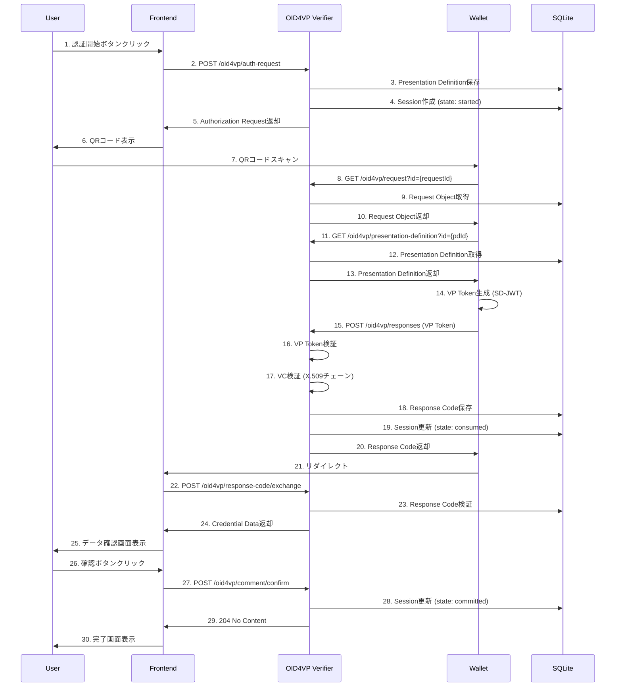
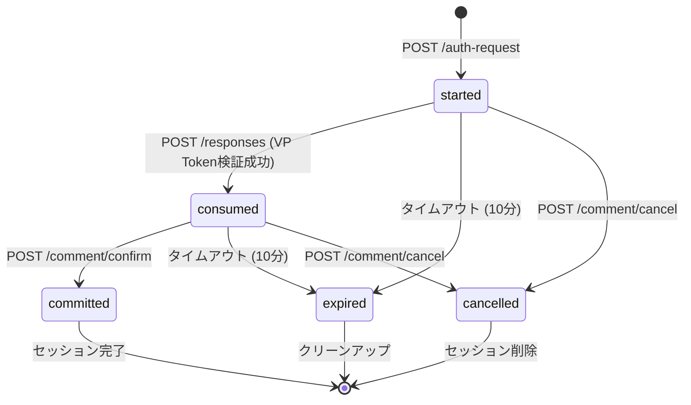

# OID4VP Verifier - 詳細アーキテクチャドキュメント

## 概要

OID4VP Verifierは、OpenID for Verifiable Presentations (OID4VP) プロトコルを実装した単一ノードシステムです。このドキュメントでは、システム全体のアーキテクチャ、各レイヤーの役割、データフロー、および技術的な実装詳細について説明します。

## システム構成

OID4VP Verifierは、シンプルな単一ノード構成で以下のコンポーネントから構成されています：

```
┌──────────────────────────────────────────────────────────┐
│                 OID4VP Verifier System                   │
├──────────────────────────────────────────────────────────┤
│                                                          │
│  ┌────────────────────────────────────────────────────┐ │
│  │         Presentation Layer (Koa Router)            │ │
│  │  - OID4VP API Endpoints (8 endpoints)              │ │
│  │  - CORS Middleware                                 │ │
│  │  - Cookie-based Session Management                 │ │
│  │  - Error Handling                                  │ │
│  └────────────────────┬───────────────────────────────┘ │
│                       │                                  │
│  ┌────────────────────▼───────────────────────────────┐ │
│  │         Use Case Layer (Interactors)               │ │
│  │  - OID4VP Interactor                               │ │
│  │  - Request/Response Handling                       │ │
│  │  - VP Token Verification                           │ │
│  │  - Presentation Definition Management              │ │
│  └────────────────────┬───────────────────────────────┘ │
│                       │                                  │
│  ┌────────────────────▼───────────────────────────────┐ │
│  │         Domain Layer (OID4VP Logic)                │ │
│  │  - Verifier (VP Token Verification)                │ │
│  │  - Credential Validator                            │ │
│  │  - SD-JWT Decoder                                  │ │
│  │  - X.509 Certificate Chain Verification            │ │
│  └────────────────────┬───────────────────────────────┘ │
│                       │                                  │
│  ┌────────────────────▼───────────────────────────────┐ │
│  │         Repository Layer (Data Access)             │ │
│  │  - OID4VP Repository (SQLite)                      │ │
│  │  - Session Management                              │ │
│  │  - Request/Response Storage                        │ │
│  └────────────────────┬───────────────────────────────┘ │
│                       │                                  │
│  ┌────────────────────▼───────────────────────────────┐ │
│  │         Infrastructure Layer (SQLite)              │ │
│  │  - Database Connection (WAL mode)                  │ │
│  │  - Schema Management                               │ │
│  │  - Transaction Handling                            │ │
│  └────────────────────────────────────────────────────┘ │
│                                                          │
│  Port: 3000 (configurable via APP_PORT)                 │
│                                                          │
└──────────────────────────────────────────────────────────┘
```

### アーキテクチャの特徴

**単一ノード構成**:
- シンプルなデプロイメント（1プロセス）
- 単一のSQLiteデータベース
- 水平スケール可能（必要に応じて複数インスタンス起動）

**レイヤー分離**:
- **Presentation Layer**: HTTPリクエスト/レスポンス処理
- **Use Case Layer**: ビジネスロジック
- **Domain Layer**: OID4VPプロトコル実装
- **Repository Layer**: データアクセス抽象化
- **Infrastructure Layer**: SQLiteデータベース

## 詳細レイヤーアーキテクチャ

### 1. Presentation Layer（プレゼンテーション層）

**役割**: HTTPリクエストを受け取り、適切なUse Caseを呼び出してレスポンスを返す

**主な責務**:
- ルーティング（8つのOID4VP APIエンドポイント）
- リクエストバリデーション
- セッション管理（Cookie-based）
- CORS設定
- エラーハンドリング

**実装ファイル**:
- `src/api.ts` - Koaアプリケーション初期化
- `src/routes/oid4vp-routes.ts` - OID4VP APIルーティング
- `src/routes/error-handler.ts` - エラーハンドリング

**OID4VP APIエンドポイント**:

```typescript
// src/routes/oid4vp-routes.ts

// 1. Authorization Request生成
router.post(`/${apiDomain}/auth-request`, async (ctx) => {
  const { presentationDefinition } = ctx.request.body;
  const result = await interactor.initiateAuthorizationRequest(presentationDefinition);

  // セッションに保存
  ctx.session.request_id = result.requestId;

  ctx.status = 200;
  ctx.body = { authorizationRequest: result.authRequest };
});

// 2. Request Object取得
router.get(`/${apiDomain}/request`, async (ctx) => {
  const requestId = ctx.query.id as string;
  const requestObject = await interactor.getRequestObject(requestId);

  ctx.status = 200;
  ctx.body = requestObject;
});

// 3. Presentation Definition取得
router.get(`/${apiDomain}/presentation-definition`, async (ctx) => {
  const pdId = ctx.query.id as string;
  const pd = await interactor.getPresentationDefinition(pdId);

  ctx.status = 200;
  ctx.body = pd;
});

// 4. VP Token受信
router.post(`/${apiDomain}/responses`, async (ctx) => {
  const { vp_token, presentation_submission } = ctx.request.body;
  const result = await interactor.receiveVpToken(vp_token, presentation_submission);

  ctx.status = 200;
  ctx.body = { response_code: result.responseCode };
});

// 5. Response Code交換
router.post(`/${apiDomain}/response-code/exchange`, async (ctx) => {
  const { response_code } = ctx.request.body;
  const result = await interactor.exchangeResponseCode(response_code);

  ctx.status = 200;
  ctx.body = { credentialData: result.credentialData };
});

// 6. データ確認
router.post(`/${apiDomain}/comment/confirm`, async (ctx) => {
  const requestId = ctx.session?.request_id;
  await interactor.confirmData(requestId);

  ctx.session = null;  // セッション削除
  ctx.status = 204;
});

// 7. データキャンセル
router.post(`/${apiDomain}/comment/cancel`, async (ctx) => {
  const requestId = ctx.session?.request_id;
  await interactor.cancelData(requestId);

  ctx.session = null;
  ctx.status = 204;
});

// 8. 状態取得
router.get(`/${apiDomain}/comment/states`, async (ctx) => {
  const requestId = ctx.session?.request_id;
  const state = await interactor.getState(requestId);

  ctx.status = 200;
  ctx.body = { state };
});
```

**セッション管理**:

```typescript
// src/api.ts

import session from "koa-session";

app.keys = [process.env.OID4VP_COOKIE_SECRET || "some secret hurr"];

const CONFIG: Partial<opts> = {
  key: "koa.sess",
  maxAge: 60 * 60 * 1000,  // 1時間
  autoCommit: true,
  overwrite: true,
  httpOnly: true,
  signed: true,
  rolling: false,
  renew: false,
  secure: !(process.env.NODE_ENV === "local" || process.env.NODE_ENV === "test"),
  sameSite: "none",
};

app.use(session(CONFIG, app));
```

**CORS設定**:

```typescript
// src/api.ts

import cors from "@koa/cors";

app.use(
  cors({
    origin: process.env.APP_HOST || "http://localhost:3001",
    allowMethods: ["POST", "GET", "OPTIONS"],
    credentials: true,  // Cookie送信を許可
  })
);
```

### 2. Use Case Layer（ユースケース層）

**役割**: ビジネスロジックを実装し、Domainレイヤーとリポジトリを調整

**主な責務**:
- OID4VPフロー全体の制御
- セッション状態管理
- VP Token検証のオーケストレーション
- エラーハンドリング

**実装ファイル**:
- `src/usecases/oid4vp-interactor.ts` - OID4VPインタラクター
- `src/usecases/oid4vp-repository.ts` - リポジトリインターフェース

**OID4VP Interactor**:

```typescript
// src/usecases/oid4vp-interactor.ts

export const initOid4vpInteractor = (
  repository: OID4VPRepository,
  verifier: Verifier,
): OID4VPInteractor => ({

  // 1. Authorization Request生成
  initiateAuthorizationRequest: async (presentationDefinition) => {
    // Presentation Definitionを保存
    const pdId = uuidv4();
    await repository.savePresentationDefinition(pdId, presentationDefinition);

    // Request Object生成
    const requestId = uuidv4();
    const nonce = uuidv4();
    const state = uuidv4();

    const requestObject = await verifier.generateRequestObject({
      clientId: process.env.OID4VP_CLIENT_ID,
      presentationDefinitionId: pdId,
      nonce,
      state,
      responseUri: process.env.OID4VP_RESPONSE_URI,
    });

    // セッション作成
    await repository.saveSession({
      id: uuidv4(),
      requestId,
      state: "started",
      nonce,
      createdAt: Date.now(),
      expiresAt: Date.now() + 600000,  // 10分
    });

    return { requestId, authRequest: requestObject };
  },

  // 2. VP Token受信・検証
  receiveVpToken: async (vpToken, presentationSubmission) => {
    // VP Token検証
    const verifiedVp = await verifier.verifyVpToken(vpToken, {
      expectedNonce: session.nonce,
    });

    // Presentation Submission検証
    const isValid = await verifier.validatePresentationSubmission(
      presentationSubmission,
      presentationDefinition,
    );

    if (!isValid) {
      throw new Error("Invalid presentation submission");
    }

    // 各VC検証
    const credentials = verifiedVp.verifiablePresentation.verifiableCredential;
    const verifiedCredentials = await Promise.all(
      credentials.map(vc => verifier.verifyCredential(vc))
    );

    // Response Code生成
    const responseCode = uuidv4();
    await repository.saveResponseCode(responseCode, {
      credentialData: verifiedCredentials,
      expiresAt: Date.now() + 600000,
    });

    // セッション更新
    await repository.updateSession(session.id, {
      state: "consumed",
      vpToken,
      credentialData: verifiedCredentials,
    });

    return { responseCode };
  },

  // 3. Response Code交換
  exchangeResponseCode: async (responseCode) => {
    const responseData = await repository.getResponseCode(responseCode);

    if (!responseData) {
      throw new Error("Invalid response code");
    }

    if (Date.now() > responseData.expiresAt) {
      throw new Error("Response code expired");
    }

    return { credentialData: responseData.credentialData };
  },

  // 4. データ確認
  confirmData: async (requestId) => {
    const session = await repository.getSession(requestId);

    if (session.state !== "consumed") {
      throw new Error("Invalid session state");
    }

    await repository.updateSession(session.id, {
      state: "committed",
      committedAt: Date.now(),
    });
  },

  // 5. データキャンセル
  cancelData: async (requestId) => {
    const session = await repository.getSession(requestId);
    await repository.deleteSession(session.id);
  },

  // 6. 状態取得
  getState: async (requestId) => {
    const session = await repository.getSession(requestId);
    return session.state;
  },
});
```

### 3. Domain Layer（ドメイン層）

**役割**: OID4VPプロトコルのコアロジックを実装

**主な責務**:
- VP Token検証（署名、Nonce、有効期限）
- VC検証（X.509証明書チェーン、SD-JWT）
- Presentation Submission検証
- Request Object生成

**実装ファイル**:
- `src/oid4vp/verifier.ts` - Verifierコア
- `src/oid4vp/auth-request.ts` - Request Object生成
- `src/tool-box/verify.ts` - VC検証
- `src/tool-box/x509/x509.ts` - X.509証明書検証

**Verifier実装**:

```typescript
// src/oid4vp/verifier.ts

export const initVerifier = (datastore: VerifierDatastore): Verifier => ({

  // Request Object生成
  generateRequestObject: async (options) => {
    const { clientId, presentationDefinitionId, nonce, state, responseUri } = options;

    // Presentation DefinitionをURIに変換
    const pdUri = `${process.env.OID4VP_PRESENTATION_DEFINITION_URI}?id=${presentationDefinitionId}`;

    // JWT署名
    const requestObjectJwt = await generateRequestObjectJwt(clientId, {
      nonce,
      state,
      responseUri,
      presentationDefinitionUri: pdUri,
    }, verifierJwk, x5c);

    return {
      client_id: clientId,
      request_uri: `${process.env.OID4VP_REQUEST_URI}?id=${requestId}`,
    };
  },

  // VP Token検証
  verifyVpToken: async (vpToken, options) => {
    const { expectedNonce } = options;

    // 1. JWT形式検証
    const decoded = decodeJwt(vpToken);

    // 2. Nonce検証
    if (decoded.nonce !== expectedNonce) {
      throw new Error("Nonce mismatch");
    }

    // 3. 署名検証
    const verified = await jwtVerify(vpToken, publicKey);

    // 4. 有効期限検証
    if (decoded.exp && Date.now() > decoded.exp * 1000) {
      throw new Error("VP Token expired");
    }

    return {
      verifiablePresentation: decoded.vp,
    };
  },

  // VC検証
  verifyCredential: async (credential) => {
    // SD-JWTデコード
    const decoded = decodeSDJWT(credential);

    // JWK取得
    const jwk = decoded.jwt.payload.cnf.jwk;
    const publicKey = await importJWK(jwk);

    // JWT署名検証
    await jwtVerify(credential, publicKey);

    // X.509証明書チェーン検証
    if (decoded.jwt.header.x5c) {
      const chainResult = await verifyCertificateChain(decoded.jwt.header.x5c);
      if (!chainResult.ok) {
        throw new Error("Certificate chain verification failed");
      }
    }

    return {
      raw: credential,
      value: decoded.jwt.payload,
      verified: true,
    };
  },

  // Presentation Submission検証
  validatePresentationSubmission: async (submission, definition) => {
    // Input Descriptor IDマッチング
    for (const descriptor of definition.input_descriptors) {
      const match = submission.descriptor_map.find(d => d.id === descriptor.id);
      if (!match) {
        return false;
      }
    }

    return true;
  },
});
```

**X.509証明書チェーン検証**:

```typescript
// src/tool-box/x509/x509.ts

export const verifyCertificateChain = async (
  x5c: string[],
): Promise<Result<boolean, X509Error>> => {
  const certs = x5c.map(cert => Certificate.fromPEM(cert));

  // チェーン検証
  for (let i = 0; i < certs.length - 1; i++) {
    const cert = certs[i];
    const issuer = certs[i + 1];

    // 署名検証
    const verifyResult = await cert.verify({
      publicKey: issuer.publicKey,
    });
    if (!verifyResult) {
      return { ok: false, error: { type: "VERIFY_FAILURE" } };
    }

    // 有効期限検証
    const now = new Date();
    if (cert.notBefore > now || cert.notAfter < now) {
      return { ok: false, error: { type: "CERT_EXPIRED" } };
    }
  }

  return { ok: true, payload: true };
};
```

### 4. Repository Layer（リポジトリ層）

**役割**: データアクセスを抽象化し、SQLiteとのインターフェースを提供

**主な責務**:
- セッション管理（CRUD）
- Request/Response保存
- Presentation Definition保存
- Response Code管理

**実装ファイル**:
- `src/usecases/oid4vp-repository.ts` - リポジトリ実装

**リポジトリ実装**:

```typescript
// src/usecases/oid4vp-repository.ts

export const saveSession = async (session: OID4VPSession): Promise<void> => {
  const db = await getDb();

  await db.run(
    `INSERT INTO sessions (id, request_id, state, vp_token, credential_data, created_at, expires_at)
     VALUES (?, ?, ?, ?, ?, ?, ?)`,
    [
      session.id,
      session.requestId,
      session.state,
      session.vpToken,
      JSON.stringify(session.credentialData),
      session.createdAt,
      session.expiresAt,
    ]
  );
};

export const getSession = async (requestId: string): Promise<OID4VPSession | null> => {
  const db = await getDb();

  const row = await db.get(
    `SELECT * FROM sessions WHERE request_id = ?`,
    [requestId]
  );

  if (!row) {
    return null;
  }

  return {
    id: row.id,
    requestId: row.request_id,
    state: row.state,
    vpToken: row.vp_token,
    credentialData: JSON.parse(row.credential_data || "{}"),
    createdAt: row.created_at,
    expiresAt: row.expires_at,
    consumedAt: row.consumed_at,
    committedAt: row.committed_at,
  };
};

export const updateSession = async (
  sessionId: string,
  updates: Partial<OID4VPSession>
): Promise<void> => {
  const db = await getDb();

  const setClauses: string[] = [];
  const values: any[] = [];

  if (updates.state) {
    setClauses.push("state = ?");
    values.push(updates.state);
  }
  if (updates.vpToken) {
    setClauses.push("vp_token = ?");
    values.push(updates.vpToken);
  }
  if (updates.credentialData) {
    setClauses.push("credential_data = ?");
    values.push(JSON.stringify(updates.credentialData));
  }
  if (updates.consumedAt) {
    setClauses.push("consumed_at = ?");
    values.push(updates.consumedAt);
  }
  if (updates.committedAt) {
    setClauses.push("committed_at = ?");
    values.push(updates.committedAt);
  }

  values.push(sessionId);

  await db.run(
    `UPDATE sessions SET ${setClauses.join(", ")} WHERE id = ?`,
    values
  );
};
```

### 5. Infrastructure Layer（インフラ層）

**役割**: SQLiteデータベースの接続・管理

**主な責務**:
- データベース接続管理
- スキーマ初期化
- WALモード設定
- トランザクション管理

**実装ファイル**:
- `src/database/connection.ts` - DB接続
- `src/database/schema.ts` - スキーマ定義

**データベース接続**:

```typescript
// src/database/connection.ts

import Database from "better-sqlite3";

let db: Database.Database | null = null;

export const getDb = (): Database.Database => {
  if (!db) {
    const dbPath = process.env.DATABASE_FILEPATH || "./data/database.sqlite";
    db = new Database(dbPath);

    // WALモード有効化
    db.pragma("journal_mode = WAL");

    // スキーマ初期化
    initSchema(db);
  }

  return db;
};

export const closeDb = (): void => {
  if (db) {
    db.close();
    db = null;
  }
};
```

**スキーマ定義**:

```typescript
// src/database/schema.ts

export const initSchema = (db: Database.Database): void => {
  // sessionsテーブル
  db.exec(`
    CREATE TABLE IF NOT EXISTS sessions (
      id TEXT PRIMARY KEY,
      request_id TEXT UNIQUE NOT NULL,
      state TEXT NOT NULL,
      vp_token TEXT,
      credential_data TEXT,
      created_at INTEGER NOT NULL,
      expires_at INTEGER NOT NULL,
      consumed_at INTEGER,
      committed_at INTEGER
    )
  `);

  // requestsテーブル
  db.exec(`
    CREATE TABLE IF NOT EXISTS requests (
      id TEXT PRIMARY KEY,
      request_object TEXT NOT NULL,
      created_at INTEGER NOT NULL,
      expires_at INTEGER NOT NULL
    )
  `);

  // presentation_definitionsテーブル
  db.exec(`
    CREATE TABLE IF NOT EXISTS presentation_definitions (
      id TEXT PRIMARY KEY,
      definition TEXT NOT NULL,
      created_at INTEGER NOT NULL
    )
  `);

  // response_codesテーブル
  db.exec(`
    CREATE TABLE IF NOT EXISTS response_codes (
      code TEXT PRIMARY KEY,
      credential_data TEXT NOT NULL,
      created_at INTEGER NOT NULL,
      expires_at INTEGER NOT NULL
    )
  `);

  // post_statesテーブル
  db.exec(`
    CREATE TABLE IF NOT EXISTS post_states (
      state TEXT PRIMARY KEY,
      request_id TEXT NOT NULL,
      created_at INTEGER NOT NULL,
      expires_at INTEGER NOT NULL
    )
  `);

  // インデックス作成
  db.exec(`
    CREATE INDEX IF NOT EXISTS idx_sessions_request_id ON sessions(request_id);
    CREATE INDEX IF NOT EXISTS idx_sessions_state ON sessions(state);
    CREATE INDEX IF NOT EXISTS idx_sessions_expires_at ON sessions(expires_at);
  `);
};
```

## データフロー

### 完全なOID4VPフロー



### セッション状態遷移



## 技術スタック

### フレームワーク・ライブラリ

| カテゴリ | 技術 | 用途 |
|---------|------|------|
| Webフレームワーク | Koa v2.15.3 | REST APIサーバー |
| ルーティング | @koa/router | APIルーティング |
| セッション管理 | koa-session | Cookie-basedセッション |
| CORS | @koa/cors | クロスオリジンリクエスト処理 |
| ボディパーサー | koa-bodyparser | JSONリクエストボディ解析 |
| データベース | better-sqlite3 | SQLiteデータベース |
| JWT/JWK | jose v5.9.6 | JWT署名・検証 |
| X.509証明書 | @peculiar/x509 | 証明書チェーン検証 |
| SD-JWT | @meeco/sd-jwt | Selective Disclosure JWT |
| ロギング | winston | 構造化ログ |

### 言語・ランタイム

- **TypeScript 5.5.4**: 型安全な開発
- **Node.js 20+**: ESModules使用
- **ビルド**: TypeScriptコンパイラ (`tsc`)

### ストレージ

- **SQLite3**: セッション管理、Request/Response保存
- **WALモード**: 同時アクセス対応
- **ファイルシステム**: データベースファイル永続化

## デプロイメント構成

### 単一インスタンス（開発・小規模）

```
┌─────────────────────────────────────┐
│     Development Environment         │
├─────────────────────────────────────┤
│                                     │
│  ┌───────────────────────────────┐ │
│  │   Frontend Application        │ │
│  │   (http://localhost:3001)     │ │
│  └───────────────┬───────────────┘ │
│                  │                  │
│                  │ CORS: APP_HOST   │
│                  ▼                  │
│  ┌───────────────────────────────┐ │
│  │   OID4VP Verifier             │ │
│  │   (http://localhost:3000)     │ │
│  │   - Koa App                   │ │
│  │   - SQLite Database           │ │
│  └───────────────────────────────┘ │
│                                     │
└─────────────────────────────────────┘
```

### 水平スケール（本番環境）

```
┌───────────────────────────────────────────────────────┐
│             Production Environment                    │
├───────────────────────────────────────────────────────┤
│                                                       │
│  ┌─────────────────────────────────────────────────┐ │
│  │         Load Balancer (Nginx/ALB)               │ │
│  │         (HTTPS Termination)                     │ │
│  └────────────────────┬────────────────────────────┘ │
│                       │                               │
│          ┌────────────┼────────────┐                  │
│          │            │            │                  │
│     ┌────▼───┐   ┌───▼────┐   ┌──▼─────┐            │
│     │ Verif  │   │ Verif  │   │ Verif  │            │
│     │ Inst 1 │   │ Inst 2 │   │ Inst 3 │            │
│     │        │   │        │   │        │            │
│     │ SQLite │   │ SQLite │   │ SQLite │            │
│     └────────┘   └────────┘   └────────┘            │
│                                                       │
│     Sticky Session (Load Balancer)                   │
│                                                       │
└───────────────────────────────────────────────────────┘
```

**注意**: 各インスタンスは独立したSQLiteデータベースを持つため、セッション共有にはSticky Sessionまたは外部セッションストア（Redis等）が必要

### ネットワーク要件

- **ポート3000（API）**: HTTPS（本番）/ HTTP（開発）
- **アウトバウンド**: なし（外部APIコール不要）
- **フロントエンドアプリからのアクセス**: CORS設定で許可

### 永続化ボリューム

- `./data/database.sqlite` - SQLiteデータベースファイル
- `./logs/` - ログファイル（オプション）

## パフォーマンス最適化

### データベース最適化

1. **WALモード**: 読み取りと書き込みの同時実行
2. **インデックス**: `request_id`, `state`, `expires_at`にインデックス
3. **プリペアドステートメント**: SQLインジェクション対策と性能向上

### セッション管理最適化

1. **短い有効期限**: 10分（デフォルト）
2. **自動クリーンアップ**: 期限切れセッションの定期削除
3. **Cookie署名**: セッション改ざん検知

### エラーハンドリング

1. **グレースフルシャットダウン**: SIGINTでDB接続を正常終了
2. **トランザクション管理**: データ整合性を保証
3. **エラーログ**: 構造化ログで詳細記録

## セキュリティアーキテクチャ

### 多層防御

```
┌─────────────────────────────────────────────┐
│  1. Transport Layer (HTTPS/TLS 1.2+)       │
├─────────────────────────────────────────────┤
│  2. Application Layer                       │
│     - CORS設定                              │
│     - Cookie-based Session (HttpOnly)       │
│     - Request Validation                    │
├─────────────────────────────────────────────┤
│  3. OID4VP Protocol Layer                   │
│     - Nonce検証 (Replay攻撃防止)            │
│     - State検証 (CSRF対策)                  │
│     - VP Token署名検証                      │
│     - X.509証明書チェーン検証               │
├─────────────────────────────────────────────┤
│  4. Data Layer                              │
│     - SQLite (Prepared Statements)          │
│     - Session有効期限管理                   │
│     - 自動クリーンアップ                    │
└─────────────────────────────────────────────┘
```

### 主なセキュリティ機能

1. **X.509証明書検証**: VP Tokenの発行者検証
2. **Nonce**: Replay攻撃防止（一意のランダム値）
3. **State**: CSRF攻撃防止
4. **Cookie署名**: セッション改ざん検知
5. **HTTPS必須**: 本番環境での暗号化通信
6. **短い有効期限**: セッション・トークンの自動失効

## まとめ

OID4VP Verifierの詳細アーキテクチャは、以下の設計原則に基づいています：

1. **シンプルさ**: 単一ノード構成で理解・運用が容易
2. **レイヤー分離**: 各レイヤーが明確な責務を持つ
3. **スケーラビリティ**: 水平スケール可能な設計
4. **セキュリティ**: 多層防御による堅牢な保護
5. **パフォーマンス**: SQLite WALモードによる高速データアクセス
6. **保守性**: TypeScriptによる型安全な実装

この設計により、Verifiable Credentialsの検証を安全かつ効率的に実行し、OID4VPプロトコルに準拠したVerifierシステムを実現しています。

## 参考資料

- [OpenID for Verifiable Presentations (OID4VP)](https://openid.net/specs/openid-4-verifiable-presentations-1_0.html)
- [W3C Verifiable Credentials Data Model](https://www.w3.org/TR/vc-data-model/)
- [DIF Presentation Exchange](https://identity.foundation/presentation-exchange/)
- [SD-JWT Specification](https://datatracker.ietf.org/doc/html/draft-ietf-oauth-selective-disclosure-jwt)
- [SQLite WAL Mode](https://www.sqlite.org/wal.html)
