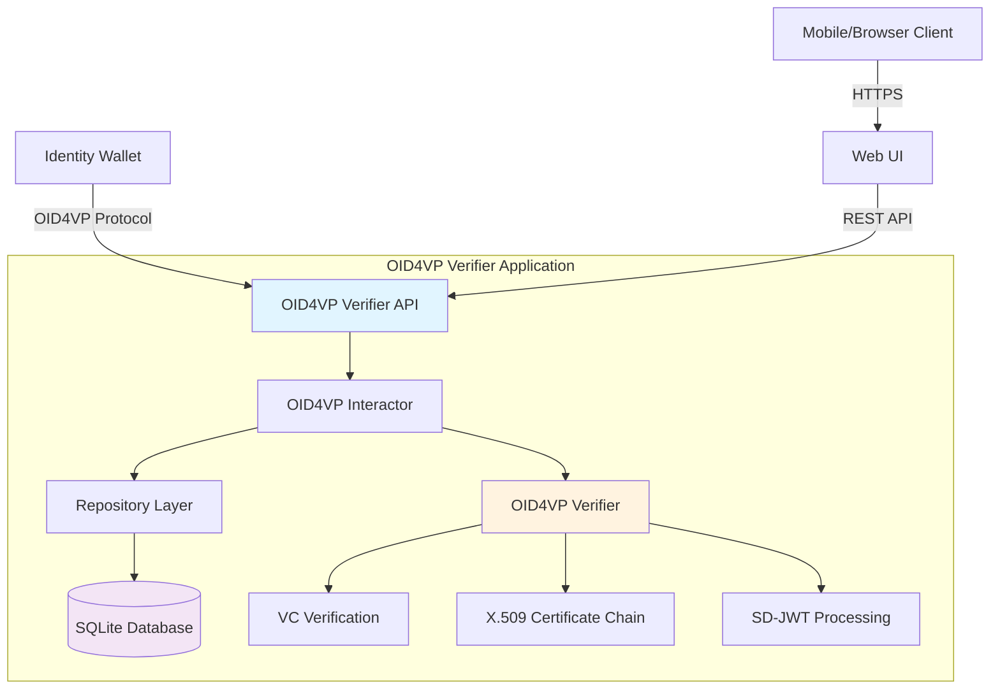
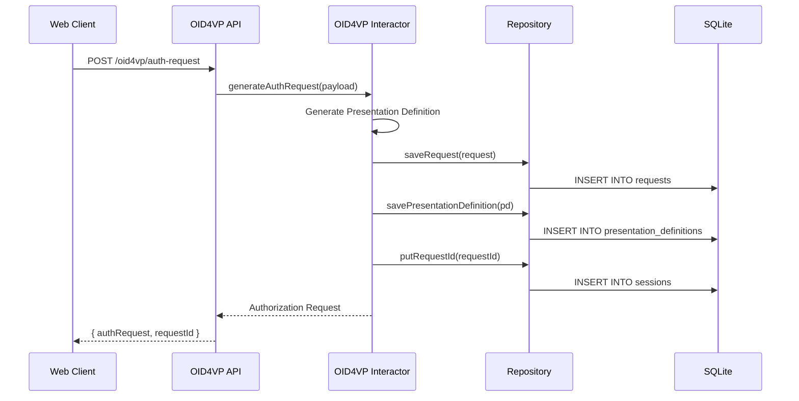
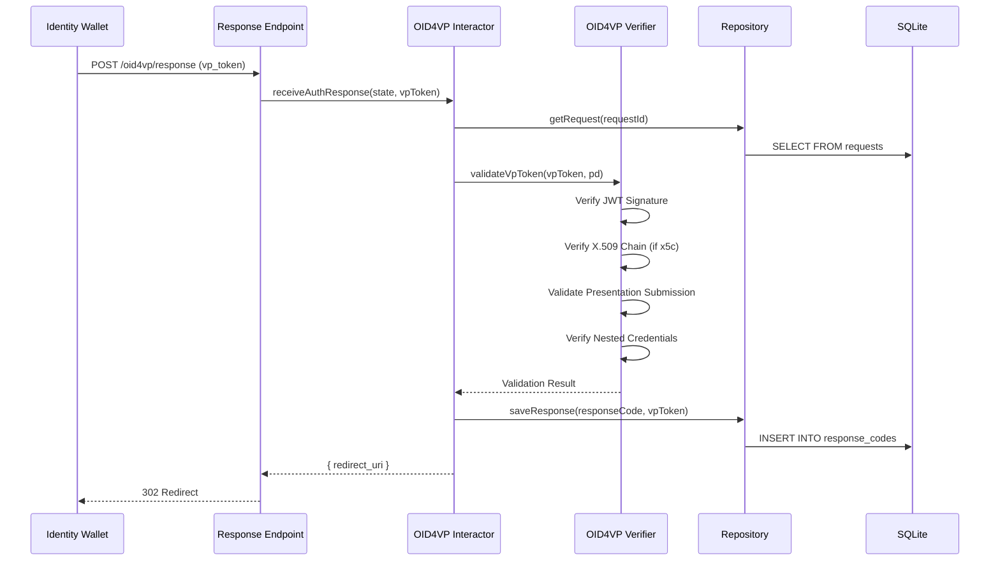
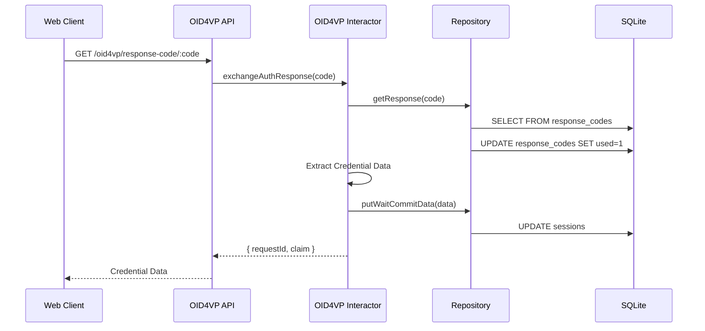

# OID4VP Verifier - システムアーキテクチャ

## 概要

このシステムは、OpenID for Verifiable Presentations (OID4VP) プロトコルに準拠した純粋なVerifierとして実装されています。Identity Walletから提示されるVerifiable Credentials (VC) を要求・検証する機能を提供します。

## 全体構成



## システム特徴

### シンプルな単一ノード構成

- **単一プロセス**: すべての機能が1つのNode.jsプロセスで動作
- **SQLite永続化**: セッション管理とリクエスト情報をSQLiteに保存
- **ステートレスAPI**: 検証処理自体はステートレス
- **スケーラブル**: 水平スケール可能な設計

### OID4VPプロトコル完全準拠

- Presentation Definition生成
- Authorization Request生成 (署名付き/なし対応)
- VP Token受信・検証
- Presentation Submission検証
- Descriptor Map処理

### 多様なクレデンシャルフォーマット対応

- **jwt_vp_json**: JWT形式のVerifiable Presentation
- **jwt_vc_json**: JWT形式のVerifiable Credential
- **vc+sd-jwt**: Selective Disclosure JWT形式のVC
- **X.509証明書チェーン検証**: x5cヘッダーによる証明書検証

## レイヤーアーキテクチャ

```
┌─────────────────────────────────────────────────────────┐
│                  Presentation Layer                     │
│  ┌──────────────────────────────────────────────────┐  │
│  │  HTTP/REST API (Koa Framework)                   │  │
│  │  - OID4VP Routes                                 │  │
│  │  - Session Management (Cookie-based)             │  │
│  │  - CORS Configuration                            │  │
│  │  - Error Handling                                │  │
│  └──────────────────────────────────────────────────┘  │
└──────────────────┬──────────────────────────────────────┘
                   │
┌──────────────────▼──────────────────────────────────────┐
│                  Use Case Layer                         │
│  ┌──────────────────────────────────────────────────┐  │
│  │  OID4VP Interactor                               │  │
│  │  - generateAuthRequest()                         │  │
│  │  - getRequestObject()                            │  │
│  │  - getPresentationDefinition()                   │  │
│  │  - receiveAuthResponse()                         │  │
│  │  - exchangeAuthResponse()                        │  │
│  │  - confirmData()                                 │  │
│  └──────────────────────────────────────────────────┘  │
│  ┌──────────────────────────────────────────────────┐  │
│  │  Credential Processors                           │  │
│  │  - Input Descriptor Matching                     │  │
│  │  - Credential Extraction                         │  │
│  │  - Constraint Validation                         │  │
│  └──────────────────────────────────────────────────┘  │
└──────────────────┬──────────────────────────────────────┘
                   │
┌──────────────────▼──────────────────────────────────────┐
│                  Repository Layer                       │
│  ┌──────────────────────────────────────────────────┐  │
│  │  Session Repository (SQLite)                     │  │
│  │  - putRequestId()                                │  │
│  │  - putWaitCommitData()                           │  │
│  │  - getSession()                                  │  │
│  └──────────────────────────────────────────────────┘  │
│  ┌──────────────────────────────────────────────────┐  │
│  │  Post State Repository (SQLite)                  │  │
│  │  - putState()                                    │  │
│  │  - getState()                                    │  │
│  └──────────────────────────────────────────────────┘  │
│  ┌──────────────────────────────────────────────────┐  │
│  │  Response Endpoint Datastore                     │  │
│  │  - saveRequest(), getRequest()                   │  │
│  │  - saveResponse(), getResponse()                 │  │
│  └──────────────────────────────────────────────────┘  │
│  ┌──────────────────────────────────────────────────┐  │
│  │  Verifier Datastore                              │  │
│  │  - saveRequest(), getRequest()                   │  │
│  │  - savePresentationDefinition()                  │  │
│  │  - getPresentationDefinition()                   │  │
│  └──────────────────────────────────────────────────┘  │
└──────────────────┬──────────────────────────────────────┘
                   │
┌──────────────────▼──────────────────────────────────────┐
│               Infrastructure Layer                      │
│  ┌──────────────────────────────────────────────────┐  │
│  │  OID4VP Core                                     │  │
│  │  - Authorization Request Builder                 │  │
│  │  - Presentation Definition Builder               │  │
│  │  - VP Token Decoder                              │  │
│  │  - Presentation Submission Validator             │  │
│  └──────────────────────────────────────────────────┘  │
│  ┌──────────────────────────────────────────────────┐  │
│  │  Verification Tools                              │  │
│  │  - JWT/JWS Signature Verification                │  │
│  │  - X.509 Certificate Chain Verification          │  │
│  │  - SD-JWT Disclosure Processing                  │  │
│  │  - JWK Thumbprint Calculation                    │  │
│  └──────────────────────────────────────────────────┘  │
│  ┌──────────────────────────────────────────────────┐  │
│  │  SQLite Database                                 │  │
│  │  - WAL Mode Enabled                              │  │
│  │  - Automatic Cleanup (Expired Records)           │  │
│  │  - ACID Transactions                             │  │
│  └──────────────────────────────────────────────────┘  │
└─────────────────────────────────────────────────────────┘
```

## データフロー

### 1. Presentation Request生成フロー



### 2. VP Token検証フロー



### 3. Response Code交換フロー



## 技術スタック

### バックエンド

- **Runtime**: Node.js 20+
- **Framework**: Koa 2.15+
- **Language**: TypeScript 5.5+
- **Database**: SQLite 3 (better-sqlite3)
- **OID4VP**: Custom implementation based on OpenID4VP spec

### 主要ライブラリ

- **@koa/cors**: CORS handling
- **koa-router**: Routing
- **koa-session**: Session management
- **jose**: JWT/JWS operations
- **@meeco/sd-jwt**: SD-JWT processing
- **pkijs**: X.509 certificate handling
- **elliptic-jwk**: Elliptic curve key operations
- **sqlite**: SQLite database interface

### 開発ツール

- **TypeScript**: Type-safe development
- **Mocha**: Testing framework
- **ESLint**: Code linting
- **Prettier**: Code formatting

## セキュリティ特性

### データ保護

- **一時的なセッションデータ**: セッション情報は有効期限付きで保存
- **自動クリーンアップ**: 期限切れレコードの自動削除
- **SQLiteトランザクション**: ACID特性による整合性保証

### 通信セキュリティ

- **HTTPS必須**: 本番環境ではHTTPS通信を推奨
- **CORS設定**: オリジンベースのアクセス制御
- **Cookie-based Session**: httpOnly, secure属性設定

### OID4VP検証

- **署名検証**: JWS署名の厳密な検証
- **X.509証明書チェーン検証**: 証明書の有効性と信頼チェーンの検証
- **Nonce検証**: リプレイアタック対策
- **有効期限チェック**: exp, iat, nbfクレームの検証
- **Presentation Submission検証**: Descriptor Mapとの整合性検証

## スケーラビリティ

### 水平スケール戦略

1. **ステートレスアプリケーション層**
   - セッション情報はSQLiteに保存
   - 複数インスタンス起動可能

2. **SQLite + ロードバランサー**
   - 読み取り専用レプリカの作成
   - LiteStreamによるレプリケーション

3. **分散キャッシュ (将来拡張)**
   - Redisによるセッション共有
   - リクエスト情報のキャッシング

### パフォーマンス最適化

- **WALモード**: SQLiteの並行アクセス性能向上
- **インデックス最適化**: 頻繁なクエリに対するインデックス
- **自動クリーンアップ**: 定期的な期限切れデータ削除

## 監視とロギング

### ログレベル

- **error**: エラー発生時
- **warn**: 警告（期限切れ、検証失敗など）
- **info**: リクエスト処理、検証成功
- **debug**: 詳細なデバッグ情報

### 監視項目

- リクエスト処理時間
- 検証成功率
- エラー発生率
- データベース接続数

## 今後の拡張可能性

### 短期的拡張

- [ ] メトリクス収集 (Prometheus)
- [ ] ヘルスチェックエンドポイント
- [ ] 管理用ダッシュボード

### 中期的拡張

- [ ] 複数Presentation Definitionテンプレート
- [ ] Credential Issuer連携
- [ ] Batch検証API

### 長期的拡張

- [ ] 分散キャッシュ対応
- [ ] マイクロサービス化
- [ ] Kubernetes対応
