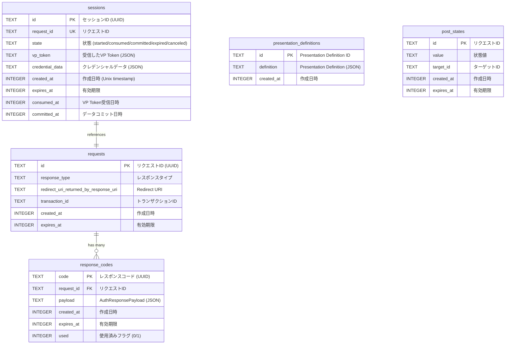

# OID4VP Verifier - Entity Relationship Diagram

## ER図

```mermaid
erDiagram
    sessions ||--|| requests : "references"
    requests ||--o{ response_codes : "has many"

    sessions {
        TEXT id PK "セッションID (UUID)"
        TEXT request_id UK "リクエストID"
        TEXT state "状態 (started/consumed/committed/expired/canceled)"
        TEXT vp_token "受信したVP Token (JSON)"
        TEXT credential_data "クレデンシャルデータ (JSON)"
        INTEGER created_at "作成日時 (Unix timestamp)"
        INTEGER expires_at "有効期限"
        INTEGER consumed_at "VP Token受信日時"
        INTEGER committed_at "データコミット日時"
    }

    requests {
        TEXT id PK "リクエストID (UUID)"
        TEXT response_type "レスポンスタイプ"
        TEXT redirect_uri_returned_by_response_uri "Redirect URI"
        TEXT transaction_id "トランザクションID"
        INTEGER created_at "作成日時"
        INTEGER expires_at "有効期限"
    }

    response_codes {
        TEXT code PK "レスポンスコード (UUID)"
        TEXT request_id FK "リクエストID"
        TEXT payload "AuthResponsePayload (JSON)"
        INTEGER created_at "作成日時"
        INTEGER expires_at "有効期限"
        INTEGER used "使用済みフラグ (0/1)"
    }

    presentation_definitions {
        TEXT id PK "Presentation Definition ID"
        TEXT definition "Presentation Definition (JSON)"
        INTEGER created_at "作成日時"
    }

    post_states {
        TEXT id PK "リクエストID"
        TEXT value "状態値"
        TEXT target_id "ターゲットID"
        INTEGER created_at "作成日時"
        INTEGER expires_at "有効期限"
    }
```

## 参照

テーブルの詳細な定義、カラム説明、インデックス、リレーションシップについては、[data-model.md](data-model.md)を参照してください。
