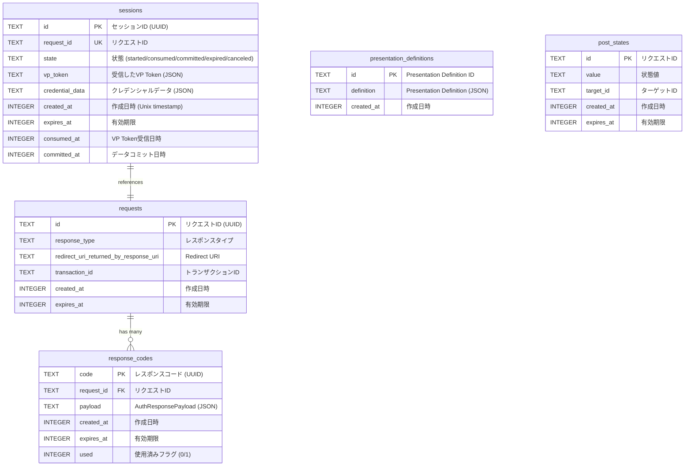

# OID4VP Verifier - Entity Relationship Diagram

## 概要

このドキュメントでは、OID4VP VerifierシステムのSQLiteデータベースのエンティティ関係図（ER図）を示します。

## ER図

## エンティティ一覧

### sessions
OID4VPセッションの状態管理

| Column | Type | Constraints | Description |
|--------|------|-------------|-------------|
| id | TEXT | PK | セッションID (UUID) |
| request_id | TEXT | UK, NOT NULL | リクエストID |
| state | TEXT | NOT NULL | 状態 (started/consumed/committed/expired/canceled) |
| vp_token | TEXT | | 受信したVP Token (JSON) |
| credential_data | TEXT | | クレデンシャルデータ (JSON) |
| created_at | INTEGER | NOT NULL | 作成日時 (Unix timestamp) |
| expires_at | INTEGER | NOT NULL | 有効期限 |
| consumed_at | INTEGER | | VP Token受信日時 |
| committed_at | INTEGER | | データコミット日時 |

### requests
OID4VP Authorization Requestのメタデータ

| Column | Type | Constraints | Description |
|--------|------|-------------|-------------|
| id | TEXT | PK | リクエストID (UUID) |
| response_type | TEXT | NOT NULL | レスポンスタイプ ("vp_token id_token") |
| redirect_uri_returned_by_response_uri | TEXT | | Response URIから返却されるRedirect URI |
| transaction_id | TEXT | | トランザクションID |
| created_at | INTEGER | NOT NULL | 作成日時 |
| expires_at | INTEGER | NOT NULL | 有効期限 |

### response_codes
Authorization Response Codeの管理

| Column | Type | Constraints | Description |
|--------|------|-------------|-------------|
| code | TEXT | PK | レスポンスコード (UUID) |
| request_id | TEXT | FK, NOT NULL | リクエストID |
| payload | TEXT | NOT NULL | AuthResponsePayload (JSON) |
| created_at | INTEGER | NOT NULL | 作成日時 |
| expires_at | INTEGER | NOT NULL | 有効期限 |
| used | INTEGER | DEFAULT 0 | 使用済みフラグ (0/1) |

### presentation_definitions
Presentation Definitionの保存

| Column | Type | Constraints | Description |
|--------|------|-------------|-------------|
| id | TEXT | PK | Presentation Definition ID |
| definition | TEXT | NOT NULL | Presentation Definition (JSON) |
| created_at | INTEGER | NOT NULL | 作成日時 |

### post_states
処理状態の追跡

| Column | Type | Constraints | Description |
|--------|------|-------------|-------------|
| id | TEXT | PK | リクエストID |
| value | TEXT | NOT NULL | 状態値 (started/consumed/committed/expired/canceled/invalid_submission) |
| target_id | TEXT | | ターゲットID |
| created_at | INTEGER | NOT NULL | 作成日時 |
| expires_at | INTEGER | NOT NULL | 有効期限 |

## リレーションシップ

### sessions - requests (1:1)
- `sessions.request_id` → `requests.id`
- 各セッションは1つのリクエストに対応

### requests - response_codes (1:N)
- `response_codes.request_id` → `requests.id`
- 1つのリクエストに対して複数のResponse Codeが生成される可能性（通常は1つ）

### 独立エンティティ
- `presentation_definitions`: 他テーブルと直接的なリレーションなし
- `post_states`: 他テーブルと直接的なリレーションなし（idがrequest_idと同一値）

## カーディナリティ

| エンティティA | エンティティB | カーディナリティ |
|--------------|--------------|-----------------|
| sessions | requests | 1:1 |
| requests | response_codes | 1:N |

## インデックス

### sessions
- PRIMARY KEY: `id`
- INDEX: `idx_sessions_request_id` (request_id)
- INDEX: `idx_sessions_expires_at` (expires_at)
- INDEX: `idx_sessions_state` (state)

### requests
- PRIMARY KEY: `id`
- INDEX: `idx_requests_expires_at` (expires_at)
- INDEX: `idx_requests_transaction_id` (transaction_id)

### response_codes
- PRIMARY KEY: `code`
- FOREIGN KEY: `request_id` REFERENCES requests(id)
- INDEX: `idx_response_codes_request_id` (request_id)
- INDEX: `idx_response_codes_expires_at` (expires_at)
- INDEX: `idx_response_codes_used` (used)

### presentation_definitions
- PRIMARY KEY: `id`
- INDEX: `idx_presentation_definitions_created_at` (created_at)

### post_states
- PRIMARY KEY: `id`
- INDEX: `idx_post_states_expires_at` (expires_at)
- INDEX: `idx_post_states_value` (value)
