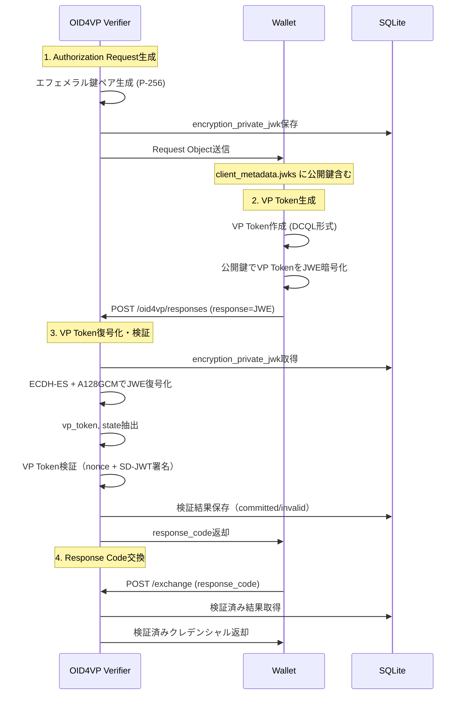

# VP Token暗号化フロー (HAIP準拠)

このドキュメントでは、HAIP (High Assurance Interoperability Profile) 準拠のVP Token暗号化フローについて説明します。

**関連ドキュメント**:
- [OID4VP実装ドキュメント](./oid4vp-implementation.md) - メインドキュメント
- [VP Token検証プロセス](./oid4vp-verification.md) - SD-JWT検証、DCQL Query定義
- [リファレンス](./oid4vp-reference.md) - セッション管理、環境変数

## 概要

VP Tokenを暗号化して送信する機能をサポートしています。暗号化は **ECDH-ES** (Elliptic Curve Diffie-Hellman Ephemeral-Static) と **A128GCM** (AES Galois/Counter Mode with 128-bit key) を使用します。

## 暗号化フロー



## 実装詳細

### 1. エフェメラル鍵ペア生成

**関数**: `generateEphemeralKeyPair()` (src/helpers/jwt-helper.ts)

```typescript
import { generateKeyPairSync } from "crypto";
import { publicJwkFromPrivate } from "elliptic-jwk";

export const generateEphemeralKeyPair = () => {
  const { privateKey } = generateKeyPairSync("ec", {
    namedCurve: "P-256",
  });

  const privateJwk = privateKey.export({ format: "jwk" });
  const publicJwk = publicJwkFromPrivate(privateJwk);

  return { privateJwk, publicJwk };
};
```

**処理**: `initiateTransaction` (src/oid4vp/response-endpoint.ts)

```typescript
const initiateTransaction = async (options) => {
  const { responseType, redirectUriReturnedByResponseUri, useTransactionId, expiredIn } = options;

  const requestId = uuidv4();
  const transactionId = useTransactionId ? uuidv4() : undefined;

  // エフェメラル鍵ペア生成
  const { privateJwk, publicJwk } = generateEphemeralKeyPair();

  // リクエスト保存（秘密鍵をDB保存）
  await saveRequest({
    id: requestId,
    responseType,
    redirectUriReturnedByResponseUri,
    transactionId,
    issuedAt: Date.now() / 1000,
    expiredIn,
    encryption_private_jwk: JSON.stringify(privateJwk),  // ← DB保存
  });

  return {
    id: requestId,
    transactionId,
    encryptionPublicJwk: publicJwk,  // ← Request Objectに含める
  };
};
```

### 2. Request Object生成（暗号化公開鍵を含む）

**Request Objectペイロード** (OID4VP 1.0形式):

```json
{
  "response_type": "vp_token",
  "response_mode": "direct_post.jwt",
  "response_uri": "http://localhost/oid4vp/responses",
  "client_id": "x509_san_dns:example.com",
  "nonce": "7f8a9b0c1d2e3f4g5h6i7j8k9l0m1n2o",
  "state": "req-123",
  "client_metadata": {
    "jwks": {
      "keys": [
        {
          "kty": "EC",
          "crv": "P-256",
          "x": "WKn-ZIGevcwGIyyrzFoZNBdaq9_TsqzGl96oc0CWuis",
          "y": "y77t-RvAHRKTsSGdIYUfweuOvwrvDD-Q3Hv5J0fSKbE",
          "kid": "enc-key-123",
          "use": "enc",
          "alg": "ECDH-ES"
        }
      ]
    },
    "encrypted_response_enc_values_supported": ["A128GCM"],
    "vp_formats": { "dc+sd-jwt": {} },
    "client_name": "boolcheck.com",
    "logo_uri": "http://localhost/logo.png"
  },
  "dcql_query": { ... }
}
```

**重要フィールド**:
- `response_mode`: `"direct_post.jwt"` (暗号化時は必須)
- `client_metadata.jwks`: 暗号化用公開鍵（ECDH-ES P-256）
- `client_metadata.encrypted_response_enc_values_supported`: サポートする暗号化方式（A128GCM）

### 3. Walletによる暗号化（Wallet側の処理）

Walletは以下の手順でVP Tokenを暗号化します:

```typescript
// 1. 公開鍵取得
const encryptionPublicJwk = requestObject.client_metadata.jwks.keys[0];

// 2. VP Token準備
const payload = {
  vp_token: { learning_credential: ["SD-JWT..."] },
  state: "req-123"
};

// 3. JWE暗号化 (ECDH-ES + A128GCM)
const jwe = await encryptJWE(
  payload,
  encryptionPublicJwk,
  { alg: "ECDH-ES", enc: "A128GCM" }
);

// 4. Response Endpointに送信
await fetch("/oid4vp/responses", {
  method: "POST",
  headers: { "Content-Type": "application/x-www-form-urlencoded" },
  body: `response=${encodeURIComponent(jwe)}&state=req-123`
});
```

### JWE構造

```
eyJhbGciOiJFQ0RILUVT...  ←ヘッダー (Base64URL)
.
                        ←暗号化キー (空: ECDH-ESの場合)
.
8Q1SzinasR3xchYz8ZIw...  ←初期化ベクトル (Base64URL)
.
yVi-LdQQngN0C9JwUL-P...  ←暗号文 (Base64URL)
.
WuGzxmcreYjpHGJoa17EBg  ←認証タグ (Base64URL)
```

**JWEヘッダー**:

```json
{
  "alg": "ECDH-ES",
  "enc": "A128GCM",
  "kid": "enc-key-123",
  "epk": {
    "kty": "EC",
    "crv": "P-256",
    "x": "gI0GAILBdu7T53akrFmMyGcsF3n5dO7MmwNBHKW5SV0",
    "y": "SLW_xSffzlPWrHEVI30DHM_4egVwt3NQqeUD7nMFpps"
  }
}
```

- `epk` (ephemeral public key): Walletが生成したエフェメラル公開鍵
- Verifierの秘密鍵とWalletの`epk`を使ってECDHで共通鍵を導出

### 4. Verifierによる復号化と検証

**関数**: `decryptJWE()` (src/helpers/jwt-helper.ts)

```typescript
import { compactDecrypt } from "jose";

export const decryptJWE = async (jwe: string, privateJwk: any) => {
  const { plaintext } = await compactDecrypt(
    jwe,
    await importJWK(privateJwk, "ECDH-ES")
  );

  const decoder = new TextDecoder();
  const payload = JSON.parse(decoder.decode(plaintext));

  return payload;
};
```

**処理**: `receiveAuthResponse` (src/oid4vp/response-endpoint.ts)

```typescript
const receiveAuthResponse = async (payload, opts) => {
  const { response, state } = payload;
  logger.info(`[requestId=${state}] receiveAuthResponse start`);

  // 1. リクエスト取得
  const request = await getRequest(state || extractStateFromJWE(response));
  if (!request) return { ok: false, error: { type: "REQUEST_ID_IS_NOT_FOUND" } };

  // 2. 暗号化レスポンスの場合: JWE復号化
  let actualPayload;
  if (response) {
    logger.info(`[requestId=${state}] Attempting JWE decryption`);
    // encryption_private_jwkを取得
    const privateJwk = JSON.parse(request.encryption_private_jwk);

    // JWE復号化
    actualPayload = await decryptJWE(response, privateJwk);
    logger.info(`[requestId=${state}] JWE decryption successful`);
  } else {
    // 非暗号化レスポンス
    actualPayload = payload;
  }

  const { vp_token, state: actualState } = actualPayload;

  // 3. VP Token検証（検証コールバックが提供されている場合）
  // ※ 復号化直後にVP Token検証を実行
  let verificationResult;
  if (opts?.verificationCallback && vp_token && request.nonce) {
    logger.info(`[requestId=${state}] Starting VP Token verification`);
    verificationResult = await verifyVpTokenWithCallback(
      vp_token,
      request.nonce,
      opts.verificationCallback,
      state,
    );
    logger.info(`[requestId=${state}] VP Token verification completed`);
  }

  // 4. レスポンス保存（検証結果を含む）
  // ...
};
```

**重要**: VP Token検証はJWE復号化の直後、`/responses`エンドポイントで実行されます。`/exchange`エンドポイントでは検証済みの結果を返却するのみです。

## 暗号化アルゴリズム仕様

| 項目 | 仕様 |
|------|------|
| **鍵合意アルゴリズム** | ECDH-ES (Elliptic Curve Diffie-Hellman Ephemeral-Static) |
| **暗号化方式** | A128GCM (AES-GCM with 128-bit key) |
| **楕円曲線** | P-256 (secp256r1) |
| **鍵のライフサイクル** | リクエストごとに新しいエフェメラル鍵ペアを生成 |
| **秘密鍵保存場所** | requestsテーブルの`encryption_private_jwk`カラム |
| **秘密鍵削除タイミング** | リクエスト有効期限切れ時（デフォルト10分） |

## セキュリティ考慮事項

1. **エフェメラル鍵の使用**: 各リクエストごとに新しい鍵ペアを生成し、Forward Secrecyを確保
2. **鍵の自動削除**: リクエスト有効期限切れ時に秘密鍵を自動削除
3. **認証付き暗号化**: A128GCM使用により、暗号文の改ざん検知が可能
4. **HAIP準拠**: High Assurance Interoperability Profileの要件を満たす

## 環境変数

| 変数名 | 説明 | デフォルト値 |
|-------|------|-------------|
| `OID4VP_VP_TOKEN_ENCRYPTION_ENABLED` | VP Token暗号化を有効化 | `false` |

**有効化方法**:

```bash
export OID4VP_VP_TOKEN_ENCRYPTION_ENABLED=true
```
