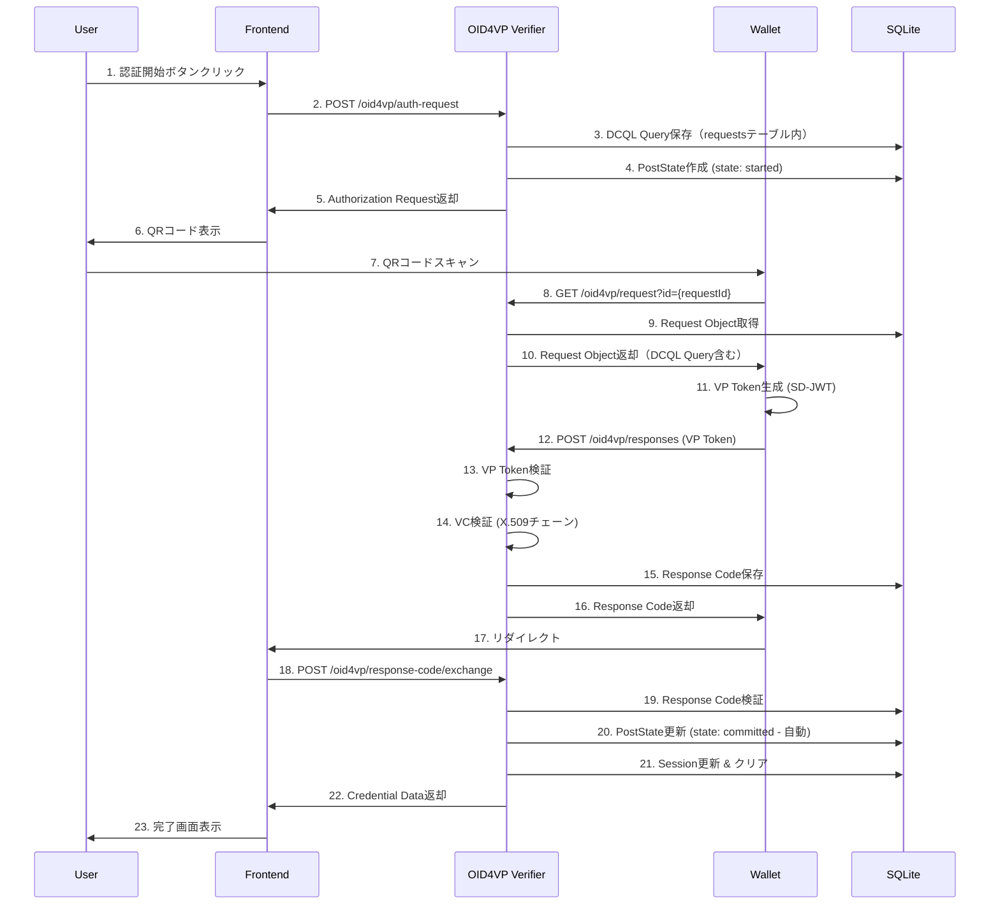
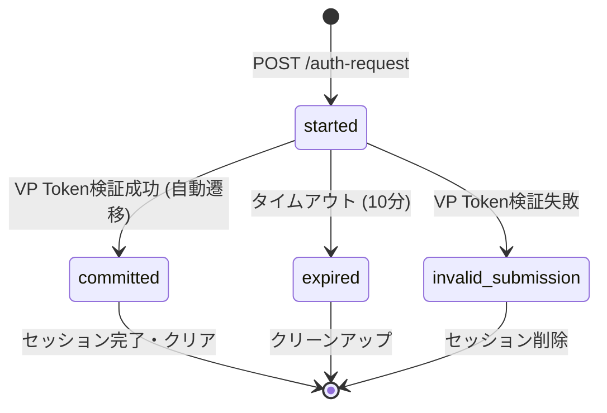
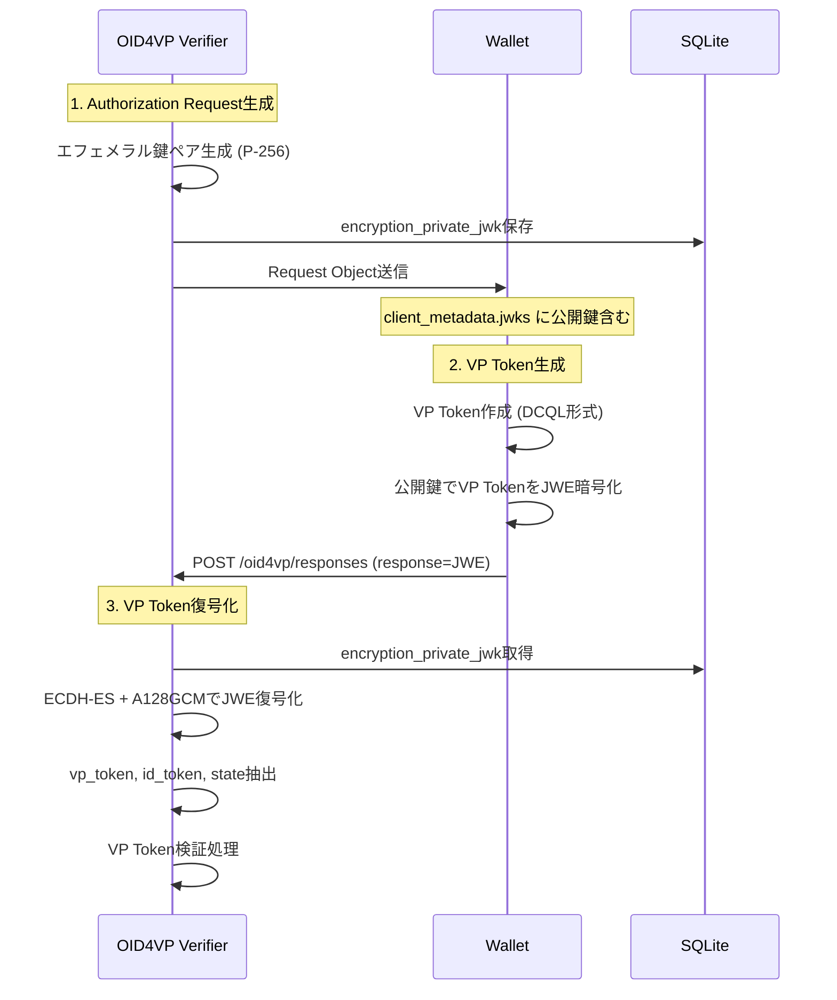

# OID4VP実装ドキュメント

## 概要

このドキュメントでは、OID4VP VerifierシステムにおけるOpenID for Verifiable Presentations (OID4VP)の実装詳細について説明します。OID4VPは、Identity Walletから検証可能なクレデンシャルを受け取り、検証済みデータを安全に取得するための認証プロトコルです。

## OID4VPとは

**OpenID for Verifiable Presentations (OID4VP)** は、W3C Verifiable Credentials (VC) をOAuth 2.0/OpenID Connectフレームワークで利用するためのプロトコルです。

### 主な特徴

- **Verifier**: クレデンシャルの検証を行うサーバー（本システム）
- **Holder**: クレデンシャルを保持するウォレットアプリ（ユーザーのIdentity Wallet）
- **Presentation**: ウォレットがVerifierに提示するクレデンシャルのセット
- **DCQL Query**: Verifierが要求するクレデンシャルの条件（OID4VP 1.0で導入）
- **SD-JWT**: Selective Disclosure JWT（選択的開示）

### OID4VP 1.0への移行

本システムはOID4VP 1.0仕様に準拠しており、以下の変更が適用されています:
- **Presentation Exchange (PEX)廃止**: Presentation DefinitionとPresentation Submissionは使用されません
- **DCQL導入**: クレデンシャル要求はDigital Credentials Query Language (DCQL)で記述されます
- **VP Token構造変更**: DCQL形式（JSON object with credential query ID as key）を使用

### プロトコルフロー（簡易版）

```
┌─────────────┐                                      ┌──────────────┐
│   Wallet    │                                      │  OID4VP      │
│    (Holder) │                                      │   Verifier   │
└──────┬──────┘                                      └──────┬───────┘
       │                                                     │
       │ 1. POST /oid4vp/auth-request                       │
       │───────────────────────────────────────────────────>│
       │                                                     │
       │   { authRequest, requestId, transactionId }        │
       │<───────────────────────────────────────────────────│
       │                                                     │
       │ 2. Parse authRequest (oid4vp://...)                │
       │                                                     │
       │ 3. GET /oid4vp/request?id=...                      │
       │───────────────────────────────────────────────────>│
       │                                                     │
       │   Request Object (JWT with dcql_query)             │
       │<───────────────────────────────────────────────────│
       │                                                     │
       │ 4. User selects credentials in Wallet              │
       │                                                     │
       │ 5. POST /oid4vp/responses                          │
       │    (vp_token as JSON object, state)                │
       │───────────────────────────────────────────────────>│
       │                                                     │
       │   { redirect_uri: "...#response_code=..." }        │
       │<───────────────────────────────────────────────────│
       │                                                     │
       │ 6. Redirect to response_code                       │
       │                                                     │
       │ 7. POST /oid4vp/response-code/exchange             │
       │    ?response_code=...                              │
       │    (VP Token検証成功後、自動的にcommitted状態へ)   │
       │───────────────────────────────────────────────────>│
       │                                                     │
       │   { claimer: { id_token, organization, icon } }    │
       │<───────────────────────────────────────────────────│
       │                                                     │
```

**注**: OID4VP 1.0では、Presentation Definition エンドポイント (Step 4) は廃止されました。DCQL queryはRequest Object内に直接含まれます。

## アーキテクチャ

### コンポーネント構成

```
┌──────────────────────────────────────────────────┐
│        OID4VP Verifier (src/oid4vp/)             │
├──────────────────────────────────────────────────┤
│                                                  │
│  ┌──────────────────────────────────────────┐   │
│  │  OID4VP Interactor                       │   │
│  │  (usecases/oid4vp-interactor.ts)         │   │
│  │  - generateAuthRequest()                 │   │
│  │  - receiveAuthResponse()                 │   │
│  │  - exchangeAuthResponse()                │   │
│  │  - getStates()                           │   │
│  └────────┬─────────────────────────────────┘   │
│           │                                      │
│           ├──────────┬──────────┬───────────┐   │
│           ▼          ▼          ▼           ▼   │
│  ┌────────────┐ ┌──────────┐ ┌─────────┐ ┌────┴──────┐
│  │  Verifier  │ │ Response │ │  State  │ │  Session  │
│  │            │ │ Endpoint │ │   Repo  │ │    Repo   │
│  │ (verifier) │ │(response-│ │(SQLite) │ │ (SQLite)  │
│  │    .ts)    │ │endpoint) │ │         │ │           │
│  └────────────┘ └──────────┘ └─────────┘ └───────────┘
│                                                  │
│  ┌──────────────────────────────────────────┐   │
│  │  Credential Processors                   │   │
│  │  - credential2-processor.ts (Affiliation)│   │
│  │  - extractCredentialFromVpToken (DCQL)   │   │
│  └──────────────────────────────────────────┘   │
│                                                  │
│  ┌──────────────────────────────────────────┐   │
│  │  SQLite Database                         │   │
│  │  - sessions                              │   │
│  │  - requests                              │   │
│  │  - response_codes                        │   │
│  │  - post_states                           │   │
│  └──────────────────────────────────────────┘   │
│                                                  │
└──────────────────────────────────────────────────┘
```

### データストア

OID4VP VerifierはSQLiteデータベースを使用してOID4VP関連データを管理：

| テーブル名 | 用途 |
|-----------|------|
| `sessions` | OID4VPセッション状態管理（vp_token, credential_dataなど） |
| `requests` | VP requestメタデータ（response_type, transaction_idなど） |
| `response_codes` | Authorization response codes（payload, usedフラグ） |
| `post_states` | 認証フローの状態追跡（started/committed/expired/invalid_submissionなど） |

**注**: `presentation_definitions`テーブルはOID4VP 1.0への移行に伴い廃止されました（DCQL導入のため）。

## 認証フロー詳細

### 1. 認証リクエスト生成（generateAuthRequest）

**エンドポイント**: `POST /oid4vp/auth-request`

**処理フロー**:

```typescript
// src/usecases/oid4vp-interactor.ts
const generateAuthRequest = async (presenter) => {
  // 1. トランザクション開始（Response Endpoint）
  const request = await responseEndpoint.initiateTransaction({
    responseType: "vp_token id_token",
    redirectUriReturnedByResponseUri: "...",
    expiredIn: 600,
  });
  // request.id, request.transactionId が生成される

  // 2. DCQL Query生成（OID4VP 1.0）
  const dcqlQuery = verifier.generateDcqlQuery([
    {
      id: "affiliation_credential",
      format: "vc+sd-jwt",
      meta: {
        vct_values: ["OrganizationalAffiliationCertificate"],
      },
      claims: [
        { path: ["organization_name"] },
        { path: ["family_name"] },
        { path: ["given_name"] },
        { path: ["portrait"] },
      ],
    },
  ]);

  // 3. Verifierリクエスト開始
  // OID4VP 1.0: clientIdにプレフィックスを含める
  const clientIdWithPrefix = `x509_san_dns:${clientId}`;
  const authRequest = await verifier.startRequest(request, clientIdWithPrefix, {
    expiredIn: 600,
    issuerJwk: verifierJwk,
    x5c: verifierX5c,
    requestObject: {
      responseUri: responseUri,
      dcqlQuery,  // DCQL Query（Presentation Definitionの代わり）
      clientMetadata: generateClientMetadata(),
    },
  });

  // 4. ポストステート作成
  await stateRepository.putState(request.id, "started");

  // 5. レスポンス返却
  return presenter(authRequest, request.id, request.transactionId);
};
```

**生成されるデータ**:

1. **Request @ Response Endpoint**:
   ```json
   {
     "id": "req-123",
     "responseType": "vp_token id_token",
     "transactionId": "tx-456",
     "issuedAt": 1705300000,
     "expiredIn": 600
   }
   ```

2. **Request @ Verifier**:
   ```json
   {
     "id": "req-123",
     "nonce": "7f8a9b0c1d2e3f4g5h6i7j8k9l0m1n2o",
     "issuedAt": 1705300000,
     "expiredIn": 600,
     "consumedAt": 0
   }
   ```

3. **DCQL Query** (OID4VP 1.0):
   ```json
   {
     "credentials": [
       {
         "id": "affiliation_credential",
         "format": "vc+sd-jwt",
         "meta": {
           "vct_values": ["OrganizationalAffiliationCertificate"]
         },
         "claims": [
           { "path": ["organization_name"] },
           { "path": ["family_name"] },
           { "path": ["given_name"] },
           { "path": ["portrait"] }
         ]
       }
     ]
   }
   ```

4. **Authorization Request** (JWTとして返却):
   ```
   oid4vp://localhost/request?client_id=http://localhost&request_uri=http://localhost/oid4vp/request?id=req-123
   ```

### 2. リクエストオブジェクト取得（getRequestObject）

**エンドポイント**: `GET /oid4vp/request?id=req-123`

**注**: OID4VP 1.0では`presentationDefinitionId`パラメータは不要です（DCQL queryはRequest Object内に含まれます）。

**処理フロー**:

```typescript
const getRequestObject = async (requestId) => {
  // 1. リクエスト検証
  const request = await getRequest(requestId);
  if (!request) return { ok: false, error: { type: "NOT_FOUND" } };
  if (isExpired(request)) return { ok: false, error: { type: "EXPIRED" } };
  if (request.consumedAt > 0) return { ok: false, error: { type: "CONSUMED" } };

  // 2. DCQL Queryを含むRequest Object (JWT)生成
  // OID4VP 1.0: clientIdにプレフィックスを含める
  const clientIdWithPrefix = `x509_san_dns:${clientId}`;
  const requestObjectJwt = await generateRequestObjectJwt(
    clientIdWithPrefix,
    {
      nonce: request.nonce,
      state: request.id,
      responseUri: responseUri,
      dcqlQuery: request.dcql_query,  // DCQL Query（DB保存済み）
      clientMetadata: generateClientMetadata(),
    },
    verifierJwk,
    verifierX5c,
  );

  return { ok: true, payload: requestObjectJwt };
};
```

**Request Object (JWT)**:

ヘッダー:
```json
{
  "alg": "ES256",
  "typ": "JWT",
  "x5c": ["MIICx..."]
}
```

ペイロード:
```json
{
  "client_id": "http://localhost",
  "client_id_scheme": "x509_san_dns",
  "response_type": "vp_token id_token",
  "response_mode": "direct_post",
  "response_uri": "http://localhost/oid4vp/responses",
  "nonce": "7f8a9b0c1d2e3f4g5h6i7j8k9l0m1n2o",
  "state": "req-123",
  "dcql_query": {
    "credentials": [
      {
        "id": "affiliation_credential",
        "format": "vc+sd-jwt",
        "meta": {
          "vct_values": ["https://example.com/AffiliationCredential"]
        },
        "claims": [
          {"path": ["organization"]},
          {"path": ["portrait"]}
        ]
      }
    ]
  },
  "client_metadata": {
    "vp_formats": { "vc+sd-jwt": {} },
    "client_name": "boolcheck.com",
    "logo_uri": "http://localhost/logo.png",
    "client_purpose": "真偽コメントに署名します"
  }
}
```

### 3. レスポンス受信（receiveAuthResponse）

**エンドポイント**: `POST /oid4vp/responses`

**リクエスト** (application/x-www-form-urlencoded):
```
vp_token=eyJhbGciOiJFUzI1NiIsInR5cCI6IkpXVCJ9...&
presentation_submission={"id":"...","definition_id":"pd-789","descriptor_map":[...]}&
state=req-123
```

**処理フロー**:

```typescript
const receiveAuthResponse = async (payload, presenter) => {
  const { vp_token, presentation_submission, state } = payload;

  // 1. リクエスト検証
  const request = await getRequest(state);
  if (!request) return { ok: false, error: { type: "REQUEST_ID_IS_NOT_FOUND" } };
  if (isExpired(request)) return { ok: false, error: { type: "REQUEST_ID_IS_EXPIRED" } };

  // 2. レスポンス保存
  const responseCode = uuidv4();
  await saveResponse({
    id: responseCode,
    requestId: state,
    payload: { vpToken: vp_token, presentationSubmission: presentation_submission },
    issuedAt: Date.now() / 1000,
    expiredIn: 600,
  });

  // 3. リダイレクトURI返却
  const redirectUri = request.redirectUriReturnedByResponseUri;
  return presenter(redirectUri, responseCode);
};
```

**レスポンス**:
```json
{
  "redirect_uri": "https://client.example.org/cb#response_code=091535f699ea575c7937fa5f0f454aee"
}
```

### 4. レスポンスコード交換（exchangeAuthResponse）

**エンドポイント**: `POST /oid4vp/response-code/exchange?response_code=091535f699ea575c7937fa5f0f454aee`

**処理フロー**:

```typescript
const exchangeAuthResponse = async (responseCode, transactionId, presenter) => {
  // 1. レスポンス取得
  const response = await getResponse(responseCode);
  if (!response) return { ok: false, error: { type: "RESPONSE_IS_NOT_FOUND" } };
  if (isExpired(response)) return { ok: false, error: { type: "RESPONSE_IS_EXPIRED" } };

  // 2. リクエスト取得（nonceを含む）
  const request = await getRequest(response.requestId);

  // 3. VP Token検証
  const authResponse = {
    vpToken: response.payload.vpToken,
    presentationSubmission: response.payload.presentationSubmission,
  };

  // 4. Affiliation Credential処理（任意）
  const credential = await processCredential2(
    verifier,
    INPUT_DESCRIPTOR_AFFILIATION,
    authResponse,
    request.nonce,
  );

  // 5. ID Token & Claimer情報抽出
  const idToken = authResponse.idToken;
  const claimerInfo = extractClaimerInfo(authResponse, credential);

  // 6. セッション保存
  await saveSession({
    id: response.requestId,
    idToken: claimerInfo.id_token,
    affiliationJwt: credential?.payload?.raw,
  });

  // 7. VP Token検証成功時、自動的にcommitted状態に遷移
  await updatePostState(response.requestId, "committed");

  // 8. レスポンス返却
  return presenter(
    response.requestId,
    claimerInfo,
  );
};
```

**レスポンス**:
```json
{
  "claimer": {
    "id_token": "eyJhbGciOiJFUzI1NiIsInR5cCI6IkpXVCJ9...",
    "sub": "user@example.com",
    "icon": "https://example.com/icon.png",
    "organization": "Example Org"
  }
}
```

## VP Token検証プロセス

### Affiliation Credential処理

**処理フロー**:

```typescript
// 1. Descriptor Map取得
const descriptor = await verifier.getDescriptor(
  INPUT_DESCRIPTOR_AFFILIATION,
  authResponse
);
if (!descriptor.ok) return descriptor;

// 2. Presentation取得・検証
const presentation = await verifier.getPresentation(
  descriptor.payload.descriptorMap,
  verifyVpFunction,  // VP署名検証
);
if (!presentation.ok) return presentation;

// 3. Nonce検証
if (presentation.payload.vp.decoded.nonce !== nonce) {
  return { ok: false, error: { type: "INVALID_PARAMETER" } };
}

// 4. Credential取得・検証
const credential = await verifier.getCredential(
  presentation.payload,
  verifyFunction,  // VC署名検証 + X.509証明書チェーン検証
);
if (!credential.ok) return credential;

// 5. CredentialSubject抽出（所属組織情報）
const { decoded, raw } = credential.payload;
const organization = decoded.vc.credentialSubject.organization;

return { ok: true, payload: { raw, decoded } };
```

### 検証レイヤー

```
┌─────────────────────────────────────────────────┐
│  1. Presentation Submission検証                 │
│     - descriptor_mapの整合性チェック             │
│     - input_descriptorとの対応確認              │
└────────────────┬────────────────────────────────┘
                 │
                 ▼
┌─────────────────────────────────────────────────┐
│  2. VP (Verifiable Presentation) 検証           │
│     - JWT署名検証                               │
│     - nonce検証                                 │
│     - 有効期限検証                              │
└────────────────┬────────────────────────────────┘
                 │
                 ▼
┌─────────────────────────────────────────────────┐
│  3. VC (Verifiable Credential) 検証             │
│     - SD-JWTデコード                            │
│     - JWT署名検証                               │
│     - X.509証明書チェーン検証（本番のみ）       │
│     - CredentialSubject抽出                     │
└─────────────────────────────────────────────────┘
```

## SD-JWT処理

### SD-JWTとは

**Selective Disclosure JWT** は、JWTのクレームを選択的に開示できる仕組みです。

**構造**:
```
<Issuer-signed JWT>~<Disclosure 1>~<Disclosure 2>~...~<KB-JWT>
```

### デコード処理

```typescript
import { decodeSDJWT } from "@meeco/sd-jwt";

const decoded = decodeSDJWT(token);
// {
//   jwt: { header, payload, signature },
//   disclosures: [...],
//   kbJwt: { ... }
// }
```

### CredentialSubject抽出（Affiliation）

```typescript
const affiliationJwt = decodeJwt(token);
const credentialSubject = affiliationJwt.vc.credentialSubject;
// {
//   organization: "Example Organization"
// }
```

## Input Descriptor定義

### Affiliation用Input Descriptor

**ファイル**: `src/usecases/internal/input-descriptor.ts`

```typescript
export const INPUT_DESCRIPTOR_AFFILIATION: InputDescriptor = {
  id: "Affiliation",
  name: "OrganizationVerifiableID",
  purpose: "所属組織を検証します",
  group: ["B"],
  format: {
    "vc+sd-jwt": {},
  },
  constraints: {
    fields: [
      {
        path: ["$.vc.type"],
        filter: {
          type: "array",
          contains: { const: "OrganizationVerifiableID" },
        },
      },
      {
        path: ["$.vc.credentialSubject.organization"],
        filter: { type: "string" },
      },
    ],
  },
};
```

### Submission Requirements

```typescript
export const submissionRequirementAffiliation: SubmissionRequirement = {
  name: "OrganizationVerifiableID",
  rule: "pick",
  count: 1,
  from: "B",
};
```

**意味**:
- グループBのInput Descriptor（Affiliation）は**1つ選択**（任意）

## セッション管理

### セッション構造

```typescript
interface WaitCommitData extends EntityWithLifeCycle {
  data: {
    idToken: string;           // ID Token
    affiliationJwt?: string;   // Affiliation SD-JWT（任意）
  };
}
```

### ポストステート

```typescript
type PostStateValue =
  | "started"              // 認証リクエスト生成済み
  | "committed"            // VP Token検証成功（自動遷移）
  | "expired"              // セッション期限切れ
  | "invalid_submission";  // 無効な提出

interface PostState extends EntityWithLifeCycle {
  value: PostStateValue;
  targetId?: string;
}
```

### ライフサイクル

```
started → committed (VP Token検証成功時に自動遷移)
   ↓         ↓
expired   (session cleared)
```

## クライアントメタデータ

### Client Metadata生成

```typescript
export const generateClientMetadata = (): ClientMetadata => ({
  vp_formats: {
    "vc+sd-jwt": {},
  },
  client_name: process.env.OID4VP_CLIENT_METADATA_NAME || "OID4VP Verifier",
  logo_uri: process.env.OID4VP_CLIENT_METADATA_LOGO_URI || "http://localhost/logo.png",
  client_purpose: "所属証明を検証します",
  policy_uri: process.env.OID4VP_CLIENT_METADATA_POLICY_URI,
  tos_uri: process.env.OID4VP_CLIENT_METADATA_TOS_URI,
});
```

### X.509証明書

**client_id_scheme**: `x509_san_dns` を使用

- Verifierの証明書（X.509）を使用してRequest ObjectをJWTとして署名
- ウォレットはX.509証明書のSAN（Subject Alternative Name）でVerifierを検証

**JWK with X5C**:

```json
{
  "kty": "EC",
  "crv": "P-256",
  "x": "...",
  "d": "..."
}
```

**X5C** (X.509 Certificate Chain):
```
["MIICx...", "MIICy...", ...]
```

## エラーハンドリング

### エラータイプ

| エラータイプ | HTTPステータス | 説明 |
|-------------|---------------|------|
| `NOT_FOUND` | 404 | リクエスト/レスポンスが見つからない |
| `EXPIRED` | 410 | リクエスト/レスポンスが期限切れ |
| `CONSUMED` | 410 | リクエストが既に使用済み |
| `INVALID_PARAMETER` | 400 | パラメータが不正 |
| `INVALID_SUBMISSION` | 400 | Presentation Submissionが不正 |
| `NO_SUBMISSION` | 400 | Presentation Submissionが欠落 |
| `VALIDATE_FAILURE` | 400 | 署名検証失敗 |

### Descriptor Error処理

```typescript
const handleDescriptorError = (error: DescriptorError): NotSuccessResult => {
  switch (error.type) {
    case "NOT_FOUND":
      return { type: "NOT_FOUND", message: "Descriptor not found" };
    case "EXPIRED":
      return { type: "EXPIRED", message: "Request expired" };
    case "INVALID_SUBMISSION":
      return { type: "INVALID_PARAMETER", message: error.reason };
    case "NO_SUBMISSION":
      return { type: "INVALID_PARAMETER", message: "No submission" };
    default:
      return { type: "UNEXPECTED_ERROR" };
  }
};
```

## 環境変数

### OID4VP設定

| 環境変数 | 説明 | デフォルト値 |
|---------|------|------------|
| `OID4VP_CLIENT_ID` | クライアントID | `http://localhost` |
| `OID4VP_CLIENT_ID_SCHEME` | クライアントIDスキーム | `x509_san_dns` |
| `OID4VP_VERIFIER_JWK` | Verifier JWK（JSON文字列） | - |
| `OID4VP_VERIFIER_X5C` | Verifier X.509証明書（PEM形式） | - |
| `OID4VP_REQUEST_HOST` | リクエストホスト | `oid4vp://localhost/request` |
| `OID4VP_REQUEST_URI` | リクエストURI | `http://localhost/oid4vp/request` |
| `OID4VP_RESPONSE_URI` | レスポンスURI | `http://localhost/oid4vp/responses` |
| `OID4VP_REDIRECT_URI` | リダイレクトURI | `http://localhost/oid4vp/redirect` |
| ~~`OID4VP_PRESENTATION_DEFINITION_URI`~~ | ~~Presentation Definition URI~~ | **廃止** (DCQL移行のため不要) |
| `OID4VP_REQUEST_EXPIRED_IN_AT_VERIFIER` | Verifierリクエスト有効期限（秒） | `600` |
| `OID4VP_REQUEST_EXPIRED_IN_AT_RESPONSE_ENDPOINT` | レスポンスエンドポイントリクエスト有効期限（秒） | `600` |
| `OID4VP_RESPONSE_EXPIRED_IN` | レスポンス有効期限（秒） | `600` |
| `POST_SESSION_EXPIRED_IN` | セッション有効期限（秒） | `600` |
| `POST_STATE_EXPIRED_IN` | ステート有効期限（秒） | `600` |
| `COOKIE_SECRET` | クッキー暗号化キー | `some secret hurr` |
| `OID4VP_CLIENT_METADATA_NAME` | クライアント名 | `boolcheck.com` |
| `OID4VP_CLIENT_METADATA_LOGO_URI` | クライアントロゴURI | `http://localhost/logo.png` |
| `OID4VP_CLIENT_METADATA_POLICY_URI` | ポリシーURI | - |
| `OID4VP_CLIENT_METADATA_TOS_URI` | 利用規約URI | - |

## 完全なデータフロー

### 詳細なOID4VPフロー（全24ステップ）



### セッション状態遷移



## VP Token暗号化フロー (HAIP準拠)

### 概要

HAIP (High Assurance Interoperability Profile) 準拠のため、VP Tokenを暗号化して送信する機能をサポートしています。暗号化は **ECDH-ES** (Elliptic Curve Diffie-Hellman Ephemeral-Static) と **A128GCM** (AES Galois/Counter Mode with 128-bit key) を使用します。

### 暗号化フロー



### 実装詳細

#### 1. エフェメラル鍵ペア生成

**関数**: `generateEphemeralKeyPair()` (src/helpers/jwt-helper.ts)

```typescript
import { generateKeyPairSync } from "crypto";
import { publicJwkFromPrivate } from "elliptic-jwk";

export const generateEphemeralKeyPair = () => {
  const { privateKey } = generateKeyPairSync("ec", {
    namedCurve: "P-256",
  });

  const privateJwk = privateKey.export({ format: "jwk" });
  const publicJwk = publicJwkFromPrivate(privateJwk);

  return { privateJwk, publicJwk };
};
```

**処理**: `initiateTransaction` (src/oid4vp/response-endpoint.ts)

```typescript
const initiateTransaction = async (options) => {
  const { responseType, redirectUriReturnedByResponseUri, useTransactionId, expiredIn } = options;

  const requestId = uuidv4();
  const transactionId = useTransactionId ? uuidv4() : undefined;

  // エフェメラル鍵ペア生成
  const { privateJwk, publicJwk } = generateEphemeralKeyPair();

  // リクエスト保存（秘密鍵をDB保存）
  await saveRequest({
    id: requestId,
    responseType,
    redirectUriReturnedByResponseUri,
    transactionId,
    issuedAt: Date.now() / 1000,
    expiredIn,
    encryption_private_jwk: JSON.stringify(privateJwk),  // ← DB保存
  });

  return {
    id: requestId,
    transactionId,
    encryptionPublicJwk: publicJwk,  // ← Request Objectに含める
  };
};
```

#### 2. Request Object生成（暗号化公開鍵を含む）

**Request Objectペイロード**:

```json
{
  "response_type": "vp_token id_token",
  "response_mode": "direct_post.jwt",
  "response_uri": "http://localhost/oid4vp/responses",
  "client_id": "http://localhost",
  "client_id_scheme": "x509_san_dns",
  "nonce": "7f8a9b0c1d2e3f4g5h6i7j8k9l0m1n2o",
  "state": "req-123",
  "client_metadata": {
    "jwks": {
      "keys": [
        {
          "kty": "EC",
          "crv": "P-256",
          "x": "WKn-ZIGevcwGIyyrzFoZNBdaq9_TsqzGl96oc0CWuis",
          "y": "y77t-RvAHRKTsSGdIYUfweuOvwrvDD-Q3Hv5J0fSKbE",
          "kid": "enc-key-123",
          "use": "enc",
          "alg": "ECDH-ES"
        }
      ]
    },
    "encrypted_response_enc_values_supported": ["A128GCM"],
    "vp_formats": { "vc+sd-jwt": {} },
    "client_name": "boolcheck.com",
    "logo_uri": "http://localhost/logo.png"
  },
  "dcql_query": { ... }
}
```

**重要フィールド**:
- `response_mode`: `"direct_post.jwt"` (暗号化時は必須)
- `client_metadata.jwks`: 暗号化用公開鍵（ECDH-ES P-256）
- `client_metadata.encrypted_response_enc_values_supported`: サポートする暗号化方式（A128GCM）

#### 3. Walletによる暗号化（Wallet側の処理）

Walletは以下の手順でVP Tokenを暗号化します:

```typescript
// 1. 公開鍵取得
const encryptionPublicJwk = requestObject.client_metadata.jwks.keys[0];

// 2. VP Token準備
const payload = {
  vp_token: { affiliation_credential: ["SD-JWT..."] },
  id_token: "eyJhbGciOi..."
};

// 3. JWE暗号化 (ECDH-ES + A128GCM)
const jwe = await encryptJWE(
  payload,
  encryptionPublicJwk,
  { alg: "ECDH-ES", enc: "A128GCM" }
);

// 4. Response Endpointに送信
await fetch("/oid4vp/responses", {
  method: "POST",
  headers: { "Content-Type": "application/x-www-form-urlencoded" },
  body: `response=${encodeURIComponent(jwe)}&state=req-123`
});
```

**JWE構造**:

```
eyJhbGciOiJFQ0RILUVT...  ←ヘッダー (Base64URL)
.
                        ←暗号化キー (空: ECDH-ESの場合)
.
8Q1SzinasR3xchYz8ZIw...  ←初期化ベクトル (Base64URL)
.
yVi-LdQQngN0C9JwUL-P...  ←暗号文 (Base64URL)
.
WuGzxmcreYjpHGJoa17EBg  ←認証タグ (Base64URL)
```

**JWEヘッダー**:

```json
{
  "alg": "ECDH-ES",
  "enc": "A128GCM",
  "kid": "enc-key-123",
  "epk": {
    "kty": "EC",
    "crv": "P-256",
    "x": "gI0GAILBdu7T53akrFmMyGcsF3n5dO7MmwNBHKW5SV0",
    "y": "SLW_xSffzlPWrHEVI30DHM_4egVwt3NQqeUD7nMFpps"
  }
}
```

- `epk` (ephemeral public key): Walletが生成したエフェメラル公開鍵
- Verifierの秘密鍵とWalletの`epk`を使ってECDHで共通鍵を導出

#### 4. Verifierによる復号化

**関数**: `decryptJWE()` (src/helpers/jwt-helper.ts)

```typescript
import { compactDecrypt } from "jose";

export const decryptJWE = async (jwe: string, privateJwk: any) => {
  const { plaintext } = await compactDecrypt(
    jwe,
    await importJWK(privateJwk, "ECDH-ES")
  );

  const decoder = new TextDecoder();
  const payload = JSON.parse(decoder.decode(plaintext));

  return payload;
};
```

**処理**: `receiveAuthResponse` (src/oid4vp/response-endpoint.ts)

```typescript
const receiveAuthResponse = async (payload) => {
  const { response, state } = payload;

  // 1. リクエスト取得
  const request = await getRequest(state || extractStateFromJWE(response));
  if (!request) return { ok: false, error: { type: "REQUEST_ID_IS_NOT_FOUND" } };

  // 2. 暗号化レスポンスの場合: JWE復号化
  let actualPayload;
  if (response) {
    // encryption_private_jwkを取得
    const privateJwk = JSON.parse(request.encryption_private_jwk);

    // JWE復号化
    actualPayload = await decryptJWE(response, privateJwk);
  } else {
    // 非暗号化レスポンス
    actualPayload = payload;
  }

  const { vp_token, id_token, state: actualState } = actualPayload;

  // 3. 以降は通常のVP Token検証フロー
  // ...
};
```

### 暗号化アルゴリズム仕様

| 項目 | 仕様 |
|------|------|
| **鍵合意アルゴリズム** | ECDH-ES (Elliptic Curve Diffie-Hellman Ephemeral-Static) |
| **暗号化方式** | A128GCM (AES-GCM with 128-bit key) |
| **楕円曲線** | P-256 (secp256r1) |
| **鍵のライフサイクル** | リクエストごとに新しいエフェメラル鍵ペアを生成 |
| **秘密鍵保存場所** | requestsテーブルの`encryption_private_jwk`カラム |
| **秘密鍵削除タイミング** | リクエスト有効期限切れ時（デフォルト10分） |

### セキュリティ考慮事項

1. **エフェメラル鍵の使用**: 各リクエストごとに新しい鍵ペアを生成し、Forward Secrecyを確保
2. **鍵の自動削除**: リクエスト有効期限切れ時に秘密鍵を自動削除
3. **認証付き暗号化**: A128GCM使用により、暗号文の改ざん検知が可能
4. **HAIP準拠**: High Assurance Interoperability Profileの要件を満たす

### 環境変数

| 変数名 | 説明 | デフォルト値 |
|-------|------|-------------|
| `OID4VP_USE_ENCRYPTION` | VP Token暗号化を有効化 | `false` |

**有効化方法**:

```bash
export OID4VP_USE_ENCRYPTION=true
```

## まとめ

OID4VP Verifierの実装は、以下の特徴を持ちます：

1. **標準準拠**: OpenID for Verifiable Presentations仕様に準拠
2. **X.509ベース認証**: `x509_san_dns`スキームによるVerifier認証
3. **SD-JWT対応**: Selective Disclosure JWTによる選択的開示
4. **多段階検証**: Presentation → VP → VCの3段階検証
5. **Affiliation Credential検証**: 組織所属証明の検証に特化
6. **自動状態遷移**: VP Token検証成功時に自動的にcommitted状態へ遷移
7. **セッション管理**: SQLiteベースのステートフル認証フロー
8. **単一ノード構成**: シンプルな単一プロセスで動作
9. **VP Token暗号化対応**: HAIP準拠のECDH-ES + A128GCM暗号化サポート

この実装により、Identity Walletから所属組織を証明するクレデンシャルを安全に受け取り、検証することが可能になっています。
