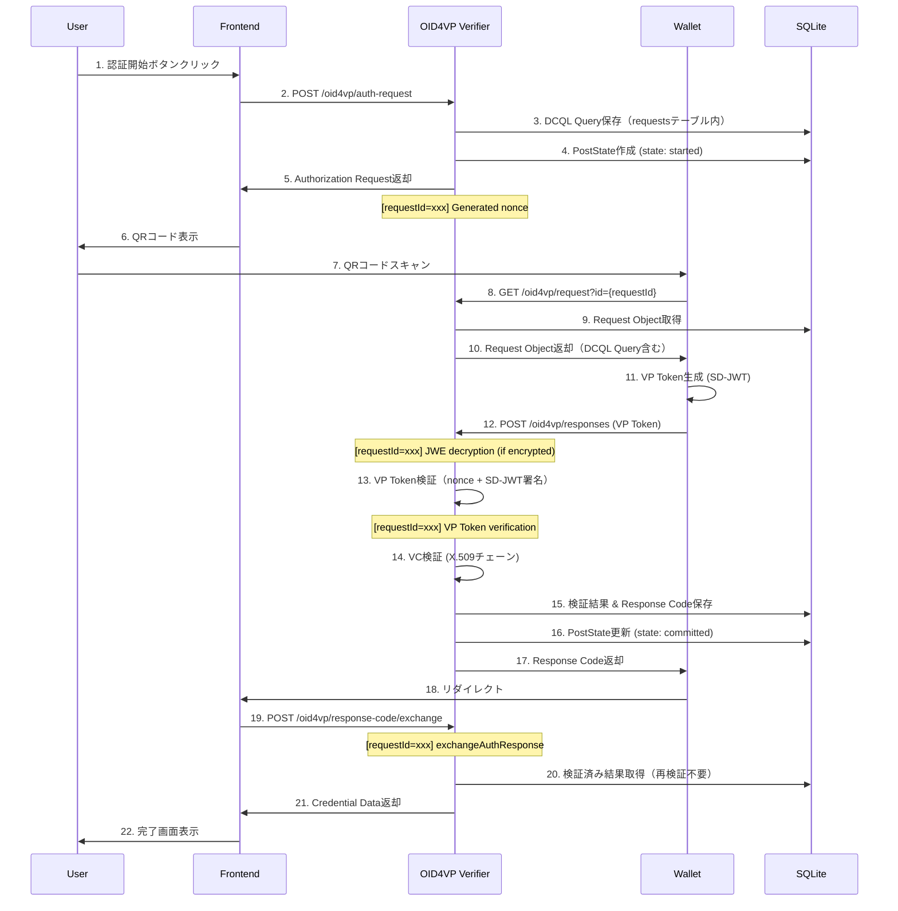
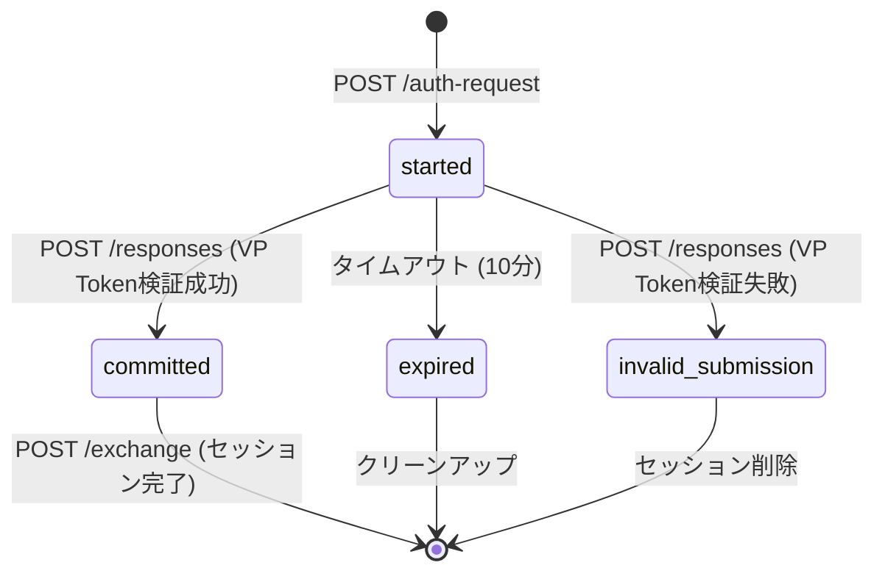

# OID4VPリファレンス

このドキュメントでは、セッション管理、クライアントメタデータ、エラーハンドリング、環境変数、およびデータフローについて説明します。

**関連ドキュメント**:
- [OID4VP実装ドキュメント](./oid4vp-implementation.md) - メインドキュメント
- [VP Token検証プロセス](./oid4vp-verification.md) - SD-JWT検証、DCQL Query定義
- [VP Token暗号化](./oid4vp-encryption.md) - HAIP準拠の暗号化フロー

## セッション管理

### セッション構造

```typescript
interface WaitCommitData extends EntityWithLifeCycle {
  data: {
    idToken: string;                  // ID Token
    learningCredentialJwt?: string;   // Learning Credential SD-JWT
  };
}
```

### ポストステート

```typescript
type PostStateValue =
  | "started"              // 認証リクエスト生成済み
  | "committed"            // VP Token検証成功（自動遷移）
  | "expired"              // セッション期限切れ
  | "invalid_submission";  // 無効な提出

interface PostState extends EntityWithLifeCycle {
  value: PostStateValue;
  targetId?: string;
}
```

### ライフサイクル

```
started → committed (VP Token検証成功時に自動遷移)
   ↓         ↓
expired   (session cleared)
```

## クライアントメタデータ

### Client Metadata生成

```typescript
export const generateClientMetadata = (): ClientMetadata => ({
  vp_formats: {
    "vc+sd-jwt": {},
  },
  client_name: process.env.OID4VP_CLIENT_METADATA_NAME || "OID4VP Verifier",
  logo_uri: process.env.OID4VP_CLIENT_METADATA_LOGO_URI || "http://localhost/logo.png",
  client_purpose: "学習証明書を検証します",
  policy_uri: process.env.OID4VP_CLIENT_METADATA_POLICY_URI,
  tos_uri: process.env.OID4VP_CLIENT_METADATA_TOS_URI,
});
```

### X.509証明書

**OID4VP 1.0**: `x509_san_dns:` または `x509_hash:` プレフィックスを`client_id`に含める

- Verifierの証明書（X.509）を使用してRequest ObjectをJWTとして署名
- ウォレットはX.509証明書のSAN（Subject Alternative Name）またはハッシュでVerifierを検証

**JWK with X5C**:

```json
{
  "kty": "EC",
  "crv": "P-256",
  "x": "...",
  "d": "..."
}
```

**X5C** (X.509 Certificate Chain):
```
["MIICx...", "MIICy...", ...]
```

## エラーハンドリング

### エラータイプ

| エラータイプ | HTTPステータス | 説明 |
|-------------|---------------|------|
| `NOT_FOUND` | 404 | リクエスト/レスポンスが見つからない |
| `EXPIRED` | 410 | リクエスト/レスポンスが期限切れ |
| `CONSUMED` | 410 | リクエストが既に使用済み |
| `INVALID_PARAMETER` | 400 | パラメータが不正（nonce不一致、SD-JWT検証失敗など） |
| `UNEXPECTED_ERROR` | 500 | 予期しないエラー |

### Credential検証エラー処理

```typescript
const handleCredentialError = (error: NotSuccessResult): NotSuccessResult => {
  switch (error.type) {
    case "NOT_FOUND":
      return { type: "NOT_FOUND", message: "Credential not found in VP Token" };
    case "INVALID_PARAMETER":
      return { type: "INVALID_PARAMETER", message: "Invalid credential: nonce mismatch or signature verification failed" };
    default:
      return { type: "UNEXPECTED_ERROR" };
  }
};
```

## 環境変数

### OID4VP設定

| 環境変数 | 説明 | デフォルト値 |
|---------|------|------------|
| `OID4VP_CLIENT_ID` | クライアントID（プレフィックスなし） | `http://localhost` |
| `OID4VP_CLIENT_ID_SCHEME` | クライアントIDスキーム（`redirect_uri`, `x509_san_dns`, `x509_hash`） | `x509_san_dns` |
| `OID4VP_VERIFIER_JWK` | Verifier JWK（JSON文字列） | - |
| `OID4VP_VERIFIER_X5C` | Verifier X.509証明書（PEM形式） | - |
| `OID4VP_REQUEST_HOST` | リクエストホスト | `oid4vp://localhost/request` |
| `OID4VP_REQUEST_URI` | リクエストURI | `http://localhost/oid4vp/request` |
| `OID4VP_RESPONSE_URI` | レスポンスURI | `http://localhost/oid4vp/responses` |
| `OID4VP_REDIRECT_URI` | リダイレクトURI | `http://localhost/oid4vp/redirect` |
| `OID4VP_VP_TOKEN_ENCRYPTION_ENABLED` | VP Token暗号化を有効化（HAIP準拠） | `false` |
| `OID4VP_REQUEST_EXPIRED_IN_AT_VERIFIER` | Verifierリクエスト有効期限（秒） | `600` |
| `OID4VP_REQUEST_EXPIRED_IN_AT_RESPONSE_ENDPOINT` | レスポンスエンドポイントリクエスト有効期限（秒） | `600` |
| `OID4VP_RESPONSE_EXPIRED_IN` | レスポンス有効期限（秒） | `600` |
| `POST_SESSION_EXPIRED_IN` | セッション有効期限（秒） | `600` |
| `POST_STATE_EXPIRED_IN` | ステート有効期限（秒） | `600` |
| `COOKIE_SECRET` | クッキー暗号化キー | `some secret hurr` |
| `OID4VP_CLIENT_METADATA_NAME` | クライアント名 | `boolcheck.com` |
| `OID4VP_CLIENT_METADATA_LOGO_URI` | クライアントロゴURI | `http://localhost/logo.png` |
| `OID4VP_CLIENT_METADATA_POLICY_URI` | ポリシーURI | - |
| `OID4VP_CLIENT_METADATA_TOS_URI` | 利用規約URI | - |

**注**: OID4VP 1.0では、`client_id`パラメータにスキームプレフィックスを含めます（例: `x509_san_dns:example.com`）。`OID4VP_CLIENT_ID_SCHEME`の値に基づいて自動的にプレフィックスが付与されます。

### トラストアンカー設定

| 環境変数 | 説明 | デフォルト値 |
|---------|------|------------|
| `OID4VP_TRUST_ANCHOR_CERTIFICATES` | カスタムトラストアンカー証明書（カンマ区切りパス） | - |

## 完全なデータフロー

### 詳細なOID4VPフロー



**注**: VP Token検証は`/responses`エンドポイント（Step 13-14）で実行されます。`/exchange`エンドポイントでは検証済みの結果を取得するのみです。

### セッション状態遷移



**注**: 状態遷移は`/responses`エンドポイントでVP Token検証後に行われます。`/exchange`エンドポイントの時点では既に`committed`または`invalid_submission`状態です。

## APIエンドポイント一覧

| メソッド | エンドポイント | 説明 |
|---------|---------------|------|
| POST | `/oid4vp/auth-request` | 認証リクエスト生成 |
| GET | `/oid4vp/request` | Request Object取得 |
| POST | `/oid4vp/responses` | VP Tokenレスポンス受信 |
| POST | `/oid4vp/response-code/exchange` | レスポンスコード交換 |
| GET | `/oid4vp/states` | ステート取得 |
| GET | `/oid4vp/credential-data` | クレデンシャルデータ取得 |

## データベーススキーマ

### requestsテーブル

| カラム | 型 | 説明 |
|-------|-----|------|
| id | TEXT | リクエストID (Primary Key) |
| response_type | TEXT | レスポンスタイプ |
| transaction_id | TEXT | トランザクションID |
| nonce | TEXT | nonce値 |
| dcql_query | TEXT | DCQL Query (JSON) |
| redirect_uri_returned_by_response_uri | TEXT | リダイレクトURI |
| issued_at | INTEGER | 発行時刻 (Unix timestamp) |
| expired_in | INTEGER | 有効期限 (秒) |
| encryption_private_jwk | TEXT | 暗号化秘密鍵 (JWK JSON) |

### sessionsテーブル

| カラム | 型 | 説明 |
|-------|-----|------|
| id | TEXT | セッションID (Primary Key) |
| id_token | TEXT | ID Token |
| learning_credential_jwt | TEXT | Learning Credential SD-JWT |
| issued_at | INTEGER | 発行時刻 (Unix timestamp) |
| expired_in | INTEGER | 有効期限 (秒) |

### post_statesテーブル

| カラム | 型 | 説明 |
|-------|-----|------|
| id | TEXT | リクエストID (Primary Key) |
| value | TEXT | 状態値 (started/committed/expired/invalid_submission) |
| target_id | TEXT | ターゲットID |
| issued_at | INTEGER | 発行時刻 (Unix timestamp) |
| expired_in | INTEGER | 有効期限 (秒) |

### response_codesテーブル

| カラム | 型 | 説明 |
|-------|-----|------|
| id | TEXT | レスポンスコード (Primary Key) |
| request_id | TEXT | リクエストID |
| payload | TEXT | ペイロード (JSON) |
| used | INTEGER | 使用フラグ |
| issued_at | INTEGER | 発行時刻 (Unix timestamp) |
| expired_in | INTEGER | 有効期限 (秒) |
