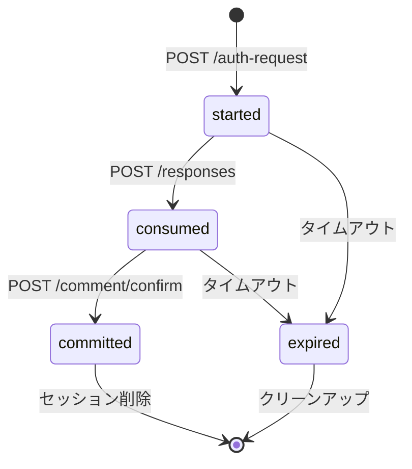
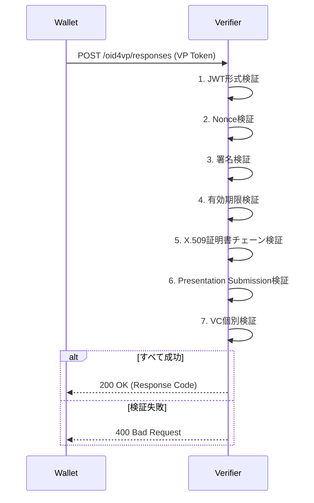

# OID4VP Verifier - セキュリティドキュメント

## 概要

このドキュメントでは、OID4VP Verifierシステムのセキュリティ実装について詳述します。システムは、X.509証明書による認証、JWT/JWK署名検証、Cookie-basedセッション管理、CORS設定など、多層防御アプローチを採用しています。

## セキュリティアーキテクチャ

```
┌──────────────────────────────────────────────────┐
│           Security Layers                        │
├──────────────────────────────────────────────────┤
│                                                  │
│  ┌────────────────────────────────────────────┐ │
│  │  1. Transport Layer Security (HTTPS)      │ │
│  │     - TLS 1.2+                            │ │
│  │     - X.509証明書による認証               │ │
│  └────────────────────────────────────────────┘ │
│                     │                            │
│  ┌─────────────────▼──────────────────────────┐ │
│  │  2. Application Layer Security            │ │
│  │     - CORS設定                            │ │
│  │     - Cookie-basedセッション管理          │ │
│  │     - リクエストバリデーション            │ │
│  └────────────────┬──────────────────────────┘ │
│                   │                              │
│  ┌────────────────▼──────────────────────────┐ │
│  │  3. OID4VP Protocol Security              │ │
│  │     - VP Token署名検証                    │ │
│  │     - VC署名検証                          │ │
│  │     - X.509証明書チェーン検証             │ │
│  │     - Nonce検証（Replay攻撃防止）         │ │
│  │     - State管理（CSRF対策）               │ │
│  └────────────────┬──────────────────────────┘ │
│                   │                              │
│  ┌────────────────▼──────────────────────────┐ │
│  │  4. Data Layer Security                   │ │
│  │     - SQLite WALモード                    │ │
│  │     - セッション有効期限管理              │ │
│  │     - 自動クリーンアップ                  │ │
│  └────────────────┬──────────────────────────┘ │
│                   │                              │
│  ┌────────────────▼──────────────────────────┐ │
│  │  5. Logging & Monitoring                  │ │
│  │     - 構造化ロギング                      │ │
│  │     - エラー追跡                          │ │
│  │     - アクセスログ                        │ │
│  └───────────────────────────────────────────┘ │
│                                                  │
└──────────────────────────────────────────────────┘
```

## 1. X.509証明書管理

### 証明書の用途

OID4VP Verifierでは、X.509証明書を以下の目的で使用：

1. **Verifier認証**: OID4VPのVerifierとしての身元証明
2. **VP Token署名生成**: Request ObjectのJWT署名
3. **VC/VP署名検証**: ウォレットから受信したクレデンシャルの署名検証

### 証明書スキーム

**client_id_scheme**: `x509_san_dns`

- Verifierの証明書にSAN（Subject Alternative Name）でDNS名を含める
- ウォレットはSANのDNS名と`client_id`を照合

**設定例**:
```bash
OID4VP_CLIENT_ID_SCHEME=x509_san_dns
OID4VP_CLIENT_ID=https://your-verifier.com
OID4VP_VERIFIER_X5C='-----BEGIN CERTIFICATE-----
MIICx...
-----END CERTIFICATE-----'
```

### 証明書チェーン検証

**ファイル**: `src/tool-box/x509/x509.ts`

**検証プロセス**:
```typescript
export const verifyCertificateChain = async (
  x5c: string[],
): Promise<Result<boolean, X509Error>> => {
  const certs = x5c.map(cert => Certificate.fromPEM(cert));

  // 1. チェーン検証
  for (let i = 0; i < certs.length - 1; i++) {
    const cert = certs[i];
    const issuer = certs[i + 1];

    // 2. 署名検証
    const verifyResult = await cert.verify({
      publicKey: issuer.publicKey,
    });
    if (!verifyResult) {
      return { ok: false, error: { type: "VERIFY_FAILURE" } };
    }

    // 3. 有効期限検証
    const now = new Date();
    if (cert.notBefore > now || cert.notAfter < now) {
      return { ok: false, error: { type: "CERT_EXPIRED" } };
    }
  }

  return { ok: true, payload: true };
};
```

**検証項目**:
1. **署名検証**: 各証明書が直上のCA証明書によって署名されているか
2. **有効期限**: 証明書が現在有効か（notBefore ≤ now ≤ notAfter）
3. **チェーン整合性**: 証明書チェーンが正しく構成されているか

### 証明書のライフサイクル

```
┌────────────┐
│  証明書発行│
│  (CA/Let's │
│  Encrypt)  │
└─────┬──────┘
      │
      ▼
┌────────────┐
│  証明書配置│
│  (X5C)     │
│  環境変数  │
└─────┬──────┘
      │
      ▼
┌────────────┐
│  署名生成  │
│  (Request  │
│   Object)  │
└─────┬──────┘
      │
      ▼
┌────────────┐
│  署名検証  │
│  (Wallet)  │
└─────┬──────┘
      │
      ▼
┌────────────┐
│  証明書更新│
│  (有効期限 │
│   前)      │
└────────────┘
```

**証明書更新**:
- 証明書の有効期限前（30日前推奨）に新しい証明書を発行
- `OID4VP_VERIFIER_X5C`環境変数を更新
- アプリケーションを再起動

**証明書失効**:
- 現在の実装ではCRL/OCSP未対応
- 将来的な改善: CRLまたはOCSPによる失効確認

**セキュリティ考慮事項**:
1. **Let's Encryptの使用**: 自動更新可能な無料SSL証明書
2. **秘密鍵の保護**: 環境変数またはシークレット管理サービスで保管
3. **証明書チェーン**: フルチェーン（リーフ証明書 + 中間CA証明書）を設定

## 2. JWT/JWK処理

### JWK (JSON Web Key)

**Verifier JWK**:
```json
{
  "kty": "EC",
  "crv": "P-256",
  "x": "...",
  "d": "..."
}
```

**設定**:
```bash
OID4VP_VERIFIER_JWK='{"kty":"EC","crv":"P-256","x":"...","d":"..."}'
```

**生成方法** (elliptic-jwk):
```typescript
import { genkey } from "elliptic-jwk";

const jwk = await genkey("P-256", true);  // privateKey=true
// { kty: "EC", crv: "P-256", x: "...", d: "..." }
```

### JWT署名と検証

#### Request Object署名

**ファイル**: `src/oid4vp/auth-request.ts`

```typescript
export const generateRequestObjectJwt = async (
  clientId: string,
  options: GenerateRequestObjectOptions,
  issuerJwk: PrivateJwk,
  x5c?: string[],
): Promise<string> => {
  const payload = generateRequestObjectPayload(clientId, options);

  // 1. JWKをインポート
  const privateKey = await importJWK(issuerJwk);

  // 2. JWTヘッダー作成
  const header: JWTHeaderParameters = {
    alg: "ES256",
    typ: "JWT",
  };
  if (x5c) {
    header.x5c = x5c;  // X.509証明書チェーン
  }

  // 3. JWT署名
  const jwt = await new SignJWT(camelToSnake(payload))
    .setProtectedHeader(header)
    .setIssuedAt()
    .setExpirationTime("10m")
    .sign(privateKey);

  return jwt;
};
```

**セキュリティポイント**:
1. **アルゴリズム**: ES256（ECDSA with P-256 and SHA-256）
2. **有効期限**: 10分（短い有効期限でReplay攻撃を軽減）
3. **X.509チェーン**: JWTヘッダーに含めてVerifier認証

#### VP Token検証

**ファイル**: `src/tool-box/verify.ts`

```typescript
export const verifyVcForW3CVcDataV1 = async <T>(
  credential: string,
  opts: { skipVerifyChain?: boolean } = {},
): Promise<ExtractedCredential<string, VerifiableCredential<T>>> => {
  // 1. SD-JWTデコード
  const decoded = decodeSDJWT(credential);

  // 2. JWK取得（`cnf.jwk`から）
  const jwk = decoded.jwt.payload.cnf.jwk;
  const publicKey = await importJWK(jwk);

  // 3. JWT署名検証
  try {
    await jwtVerify(credential, publicKey);
  } catch (err) {
    throw new Error("JWT signature verification failed");
  }

  // 4. X.509証明書チェーン検証
  if (!opts.skipVerifyChain && decoded.jwt.header.x5c) {
    const chainResult = await verifyCertificateChain(decoded.jwt.header.x5c);
    if (!chainResult.ok) {
      throw new Error("Certificate chain verification failed");
    }
  }

  return {
    raw: credential,
    value: decoded.jwt.payload as VerifiableCredential<T>,
    verified: true,
  };
};
```

**検証ステップ**:
1. **SD-JWTデコード**: Disclosuresを含むSD-JWT形式をデコード
2. **公開鍵取得**: `cnf.jwk`からHolder公開鍵を取得
3. **署名検証**: JWT署名を検証
4. **証明書チェーン検証**: X.509証明書チェーンを検証（オプション）

### SD-JWT (Selective Disclosure JWT)

**特徴**:
- クレームを選択的に開示
- Holderが開示するクレームを制御
- Verifierは必要なクレームのみを要求

**構造**:
```
<Issuer-signed JWT>~<Disclosure 1>~<Disclosure 2>~...~<KB-JWT>
```

**デコード**:
```typescript
import { decodeSDJWT } from "@meeco/sd-jwt";

const decoded = decodeSDJWT(token);
// {
//   jwt: { header, payload, signature },
//   disclosures: [{ salt, key, value }, ...],
//   kbJwt: { header, payload, signature }
// }
```

**セキュリティ考慮事項**:
- Disclosureのsaltはランダム生成され、推測不可能
- KB-JWT (Key Binding JWT)でHolder署名を検証（実装により異なる）
- DisclosureのハッシュがJWTペイロードと一致することを検証

## 3. Cookie-basedセッション管理

### セッション設定

**ファイル**: `src/api.ts`

```typescript
import session from "koa-session";

app.keys = [process.env.OID4VP_COOKIE_SECRET || "some secret hurr"];

const CONFIG: Partial<opts> = {
  key: "koa.sess",
  maxAge: 60 * 60 * 1000,  // 1時間
  autoCommit: true,
  overwrite: true,
  httpOnly: true,
  signed: true,
  rolling: false,
  renew: false,
  secure: !(process.env.NODE_ENV === "local" || process.env.NODE_ENV === "test"),
  sameSite: "none",
};

app.use(session(CONFIG, app));
```

### セキュリティ設定

| 設定 | 値 | 説明 | セキュリティ効果 |
|-----|---|------|----------------|
| `httpOnly` | `true` | JavaScriptからのアクセスを防止 | **XSS対策**: Cookie盗難を防止 |
| `signed` | `true` | セッションCookieに署名 | **改ざん検知**: Cookie改ざんを検出 |
| `secure` | `true` (本番) | HTTPS接続のみでCookie送信 | **中間者攻撃対策**: 平文通信でのCookie盗聴を防止 |
| `sameSite` | `"none"` | クロスサイトリクエストでもCookie送信 | **CORS対応**: フロントエンドとバックエンドが別オリジンの場合に必要 |
| `maxAge` | `3600000` | 1時間でセッション期限切れ | **セッション固定攻撃対策**: 短い有効期限で攻撃リスク軽減 |

**Cookie Secret**:
```bash
# ランダムな文字列を生成
node -e "console.log(require('crypto').randomBytes(32).toString('hex'))"

# .envに設定
OID4VP_COOKIE_SECRET=<generated-random-string>
```

**セキュリティベストプラクティス**:
1. **ランダム生成**: 32バイト以上のランダム文字列を使用
2. **定期的な更新**: Cookie Secretを定期的に変更（ローテーション）
3. **環境変数管理**: `.env`ファイルは`.gitignore`に追加

### セッション検証

**検証フロー**:
```typescript
// routes/oid4vp-routes.ts
router.post(`/${apiDomain}/comment/confirm`, async (ctx) => {
  // 1. セッションからrequest_id取得
  const requestId = ctx.session?.request_id;
  if (!requestId) {
    ctx.status = 400;
    ctx.body = toErrorBody("INVALID_HEADER", "Session expired or invalid");
    return;
  }

  // 2. SQLiteからセッション取得
  const session = await getSession(requestId);
  if (!session) {
    ctx.status = 400;
    ctx.body = toErrorBody("SESSION_NOT_FOUND");
    return;
  }

  // 3. セッション状態確認
  if (session.state !== "consumed") {
    ctx.status = 400;
    ctx.body = toErrorBody("INVALID_STATE");
    return;
  }

  // 4. セッション有効期限確認
  if (Date.now() > session.expires_at) {
    ctx.status = 400;
    ctx.body = toErrorBody("SESSION_EXPIRED");
    return;
  }

  // 5. データ確認処理
  // ...
});
```

### セッションライフサイクル



**状態遷移**:
1. **started**: Authorization Request生成時
2. **consumed**: VP Token受信・検証成功時
3. **committed**: データ確認完了時
4. **expired**: 有効期限切れ（自動クリーンアップ）

**セッション削除**:
```typescript
// セッション無効化（Cookie削除）
ctx.session = null;

// SQLiteからセッション削除（オプション: クリーンアップスクリプトで自動削除）
// await deleteSession(requestId);
```

### セッションハイジャック対策

1. **HTTPS必須**: 本番環境では`secure: true`でHTTPS通信のみ許可
2. **署名検証**: `signed: true`でCookie改ざん検知
3. **短い有効期限**: 1時間で自動失効（`maxAge: 3600000`）
4. **Nonce使用**: OID4VPリクエストごとに一意のnonce生成（Replay攻撃防止）
5. **State使用**: CSRF攻撃防止用のstate parameter
6. **HttpOnly**: XSS攻撃によるCookie盗難を防止

## 4. CORS設定

### CORS設定（単一ノード）

**ファイル**: `src/api.ts`

```typescript
import cors from "@koa/cors";

app.use(
  cors({
    origin: process.env.APP_HOST || "http://localhost:3001",
    allowMethods: ["POST", "GET", "OPTIONS"],
    credentials: true,
  })
);
```

### セキュリティ考慮事項

| 設定 | 値 | 説明 |
|-----|---|------|
| `origin` | `APP_HOST` | 特定のフロントエンドアプリのみアクセス許可 |
| `allowMethods` | `POST, GET, OPTIONS` | 必要最小限のHTTPメソッドのみ許可 |
| `credentials` | `true` | Cookie送信を許可（セッション管理に必要） |

**origin検証**:
- ワイルドカード（`*`）は使用しない（セキュリティリスク）
- 環境変数`APP_HOST`で特定のオリジンを設定
- 複数オリジンの場合、配列で指定または動的検証関数を使用

**動的オリジン検証**:
```typescript
app.use(
  cors({
    origin: (ctx) => {
      const allowedOrigins = [
        "https://app1.example.com",
        "https://app2.example.com",
      ];
      const requestOrigin = ctx.headers.origin;
      if (allowedOrigins.includes(requestOrigin)) {
        return requestOrigin;
      }
      return false;  // 不許可
    },
    credentials: true,
  })
);
```

### Preflight Request

**CORS Preflightの処理**:
```typescript
// OPTIONS リクエストは自動的に処理される
// @koa/corsミドルウェアが自動的に204を返す
```

### CORS攻撃対策

1. **Origin検証**: 許可されたオリジンのみアクセス可能
2. **Credential制限**: `credentials: true`を明示的に設定
3. **メソッド制限**: 必要最小限のHTTPメソッドのみ許可
4. **Preflight検証**: OPTIONS リクエストで事前検証

## 5. OID4VPプロトコルセキュリティ

### Nonce検証（Replay攻撃防止）

**Nonce生成**:
```typescript
// src/oid4vp/auth-request.ts
const nonce = uuidv4();  // ランダムなUUID

const requestObject = generateRequestObjectJwt(clientId, {
  nonce,
  responseUri,
  // ...
}, verifierJwk, x5c);
```

**Nonce検証**:
```typescript
// src/oid4vp/responses.ts
const receivedNonce = vpToken.payload.nonce;
const expectedNonce = session.nonce;

if (receivedNonce !== expectedNonce) {
  throw new Error("Nonce mismatch");
}
```

**セキュリティ効果**:
- **Replay攻撃防止**: 同じVP Tokenを再利用できない
- **セッション紐付け**: リクエストとレスポンスの対応を保証

### State管理（CSRF対策）

**State生成**:
```typescript
const state = uuidv4();  // ランダムなUUID

// Cookieに保存
ctx.session.state = state;

// Authorization Requestに含める
const authRequest = {
  client_id: clientId,
  response_type: "vp_token",
  state,
  // ...
};
```

**State検証**:
```typescript
const receivedState = ctx.request.body.state;
const expectedState = ctx.session.state;

if (receivedState !== expectedState) {
  ctx.status = 400;
  ctx.body = toErrorBody("STATE_MISMATCH", "CSRF attack detected");
  return;
}
```

### VP Token検証フロー



**検証ステップ**:
1. **JWT形式検証**: VP TokenがJWT形式か確認
2. **Nonce検証**: Replay攻撃防止
3. **署名検証**: VP TokenのJWT署名を検証
4. **有効期限検証**: VP Tokenが期限内か確認
5. **X.509証明書チェーン検証**: 証明書の有効性を確認
6. **Presentation Submission検証**: Presentation DefinitionとSubmissionの対応を確認
7. **VC個別検証**: 各Verifiable Credentialの署名と有効期限を検証

### タイムアウト設定

**環境変数**:
```bash
OID4VP_REQUEST_EXPIRED_IN=600      # Request Objectの有効期限（秒）
OID4VP_RESPONSE_EXPIRED_IN=600     # VP Tokenの有効期限（秒）
POST_SESSION_EXPIRED_IN=600        # セッションの有効期限（秒）
POST_STATE_EXPIRED_IN=600          # State parameterの有効期限（秒）
```

**セキュリティ効果**:
- **DoS攻撃対策**: 長期間のセッション保持を防止
- **メモリ管理**: 期限切れデータの自動削除
- **Replay攻撃対策**: 短い有効期限で攻撃リスク軽減

## 6. データレイヤーセキュリティ

### SQLite WALモード

**設定**:
```typescript
// src/database/connection.ts
const db = new Database(dbPath);

// WALモード有効化
db.pragma("journal_mode = WAL");
```

**セキュリティ効果**:
1. **同時アクセス**: 読み取りと書き込みの同時実行
2. **トランザクション整合性**: ACID特性の保証
3. **ロック競合軽減**: デッドロックリスク削減

### セッション有効期限管理

**自動クリーンアップ**:
```javascript
// cleanup.js
const sqlite3 = require('sqlite3');
const db = new sqlite3.Database('./data/database.sqlite');

const now = Date.now();

// 期限切れセッションを削除
db.run('DELETE FROM sessions WHERE expires_at < ?', [now], (err) => {
  if (err) console.error('Failed to clean up sessions:', err);
  else console.log('Sessions cleaned up');
});

// 期限切れレスポンスコードを削除
db.run('DELETE FROM response_codes WHERE expires_at < ?', [now], (err) => {
  if (err) console.error('Failed to clean up response_codes:', err);
  else console.log('Response codes cleaned up');
});

// 期限切れ状態を削除
db.run('DELETE FROM post_states WHERE expires_at < ?', [now], (err) => {
  if (err) console.error('Failed to clean up post_states:', err);
  else console.log('Post states cleaned up');
});

db.close();
```

**cronで定期実行**:
```bash
# crontabに追加
crontab -e

# 毎時0分にクリーンアップ
0 * * * * node /path/to/cleanup.js >> /path/to/cleanup.log 2>&1
```

### SQLインジェクション対策

**プリペアドステートメント**:
```typescript
// src/usecases/oid4vp-repository.ts
export const saveSession = async (session: OID4VPSession): Promise<void> => {
  const db = await getDb();

  // プリペアドステートメント使用（安全）
  await db.run(
    `INSERT INTO sessions (id, request_id, state, vp_token, credential_data, created_at, expires_at)
     VALUES (?, ?, ?, ?, ?, ?, ?)`,
    [
      session.id,
      session.requestId,
      session.state,
      session.vpToken,
      JSON.stringify(session.credentialData),
      session.createdAt,
      session.expiresAt,
    ]
  );
};
```

**セキュリティポイント**:
1. **プレースホルダー（?）を使用**: ユーザー入力を直接SQL文に埋め込まない
2. **パラメータバインディング**: ライブラリが自動的にエスケープ
3. **型安全**: TypeScriptの型チェックで誤った値の挿入を防止

## 7. 入力バリデーション

### リクエストバリデーション

**URL検証**:
```typescript
// バリデーション例
const validateUrl = (url: string): boolean => {
  try {
    new URL(url);
    return true;
  } catch {
    return false;
  }
};
```

**UUID検証**:
```typescript
import { validate as uuidValidate } from "uuid";

const validateUuid = (id: string): boolean => {
  return uuidValidate(id);
};
```

**VP Tokenサイズ制限**:
```typescript
// src/api.ts
import bodyParser from "koa-bodyparser";

app.use(bodyParser({
  jsonLimit: process.env.OID4VP_VERIFIER_AUTH_RESPONSE_LIMIT || "1mb",
}));
```

### サニタイゼーション

**JSON保存**:
```typescript
// 安全なJSON保存
const credentialData = JSON.stringify(session.credentialData);

// 安全なJSON読み込み
const credentialData = JSON.parse(session.credential_data);
```

**セキュリティポイント**:
- JSON形式で保存（型安全）
- 特殊文字の自動エスケープ
- XSS攻撃の防止

## 8. エラーハンドリングとロギング

### エラーログ

**ファイル**: `src/services/logging-service.ts`

```typescript
import winston from "winston";

const logger = winston.createLogger({
  level: env === "prod" ? "info" : "debug",
  format: winston.format.combine(
    winston.format.timestamp(),
    winston.format.json(),
  ),
  transports: [
    new winston.transports.Console(),
    // 本番環境ではファイルまたはクラウドロギングサービスに出力
  ],
});
```

### エラー情報の機密性

**エラーレスポンス**:
```typescript
// routes/error-handler.ts
export const toErrorBody = (
  type: string,
  message?: string,
  instance?: string,
) => ({
  type,            // エラータイプ（公開）
  message,         // エラーメッセージ（詳細は非公開）
  instance,        // リソースパス（公開）
});
```

**機密情報の除外**:
- スタックトレースは本番環境では非公開
- データベースエラーの詳細は非公開
- 内部エラーは `UNEXPECTED_ERROR` として一般化

### エラーロギング戦略

```typescript
// api.ts
app.use(async (ctx, next) => {
  try {
    await next();
  } catch (err) {
    // 1. エラーログ（詳細情報）
    errorLogger().log(err);

    // 2. クライアントレスポンス（一般化）
    ctx.status = 500;
    ctx.body = toErrorBody("UNEXPECTED_ERROR", "Unknown error");
  }
});
```

**ログレベル**:
- `error`: 例外・エラー
- `warn`: 警告
- `info`: 通常の操作（APIアクセス、DB更新）
- `debug`: デバッグ情報（本番では無効）

## 9. セキュリティベストプラクティス

### 環境変数の管理

**機密情報**:
- `OID4VP_COOKIE_SECRET`: セッションCookie暗号化キー
- `OID4VP_VERIFIER_JWK`: Verifier秘密鍵
- `OID4VP_VERIFIER_X5C`: X.509証明書

**保管方法**:
- `.env`ファイルは`.gitignore`に追加
- 本番環境では環境変数またはシークレット管理サービスを使用（AWS Secrets Manager、HashiCorp Vault等）
- テンプレート（`.env.template.*`）には実際の値を含めない

**環境別設定**:
```bash
# ローカル開発
.env.local

# テスト環境
.env.test

# 本番環境
.env.prod
```

### 依存関係の管理

**定期的な更新**:
```bash
npm update
```

**脆弱性スキャン**:
```bash
npm audit
npm audit fix
```

**自動化**:
- Dependabotを使用して自動PR作成
- GitHub Actionsで定期的なセキュリティスキャン

### レート制限（将来的な改善）

**実装例**:
```typescript
import rateLimit from "koa-ratelimit";
import Redis from "ioredis";

const limiter = rateLimit({
  driver: "redis",
  db: new Redis(),
  duration: 60000,        // 1分
  max: 100,               // 100リクエスト
  errorMessage: "Too many requests",
});

app.use(limiter);
```

### セキュリティヘッダー（推奨）

**実装例**:
```typescript
app.use(async (ctx, next) => {
  ctx.set("X-Content-Type-Options", "nosniff");
  ctx.set("X-Frame-Options", "DENY");
  ctx.set("X-XSS-Protection", "1; mode=block");
  ctx.set("Strict-Transport-Security", "max-age=31536000; includeSubDomains");
  ctx.set("Content-Security-Policy", "default-src 'self'");
  await next();
});
```

## 10. セキュリティ監査

### 監査ログ

**記録する情報**:
- API呼び出し（エンドポイント、メソッド、IPアドレス）
- セッション作成・更新・削除
- 認証イベント（成功/失敗）
- エラー・例外

**ログ形式**:
```json
{
  "timestamp": "2025-01-15T10:30:00.000Z",
  "level": "info",
  "method": "POST",
  "url": "/oid4vp/responses",
  "status": 200,
  "duration": "150ms",
  "ip": "192.168.1.100",
  "session_id": "abc123"
}
```

### 定期的なレビュー

**セキュリティチェックリスト**:
- [ ] 依存関係の脆弱性スキャン（`npm audit`）
- [ ] アクセスログのレビュー
- [ ] エラーログの分析
- [ ] X.509証明書の有効期限確認
- [ ] CORS設定の見直し
- [ ] セッションタイムアウトの妥当性確認
- [ ] SQLiteデータベースのバックアップ確認
- [ ] 期限切れデータのクリーンアップ確認

## まとめ

OID4VP Verifierのセキュリティ実装は、以下の原則に基づいています：

1. **多層防御**: 複数のセキュリティレイヤーで保護（HTTPS、Cookie、JWT、X.509）
2. **最小権限**: 必要最小限のアクセス権のみ付与
3. **暗号化**: TLS通信とJWT署名による暗号化
4. **検証**: すべての入力とトークンを検証（Nonce、State、署名、証明書）
5. **ログ記録**: セキュリティイベントの記録と監視
6. **定期的な更新**: 依存関係とセキュリティパッチの適用

この設計により、Verifiable Credentialsの信頼性と整合性を保ちながら、安全なシステム運用を実現しています。

## 参考資料

- [OpenID for Verifiable Presentations (OID4VP)](https://openid.net/specs/openid-4-verifiable-presentations-1_0.html)
- [W3C Verifiable Credentials Data Model](https://www.w3.org/TR/vc-data-model/)
- [SD-JWT Specification](https://datatracker.ietf.org/doc/html/draft-ietf-oauth-selective-disclosure-jwt)
- [OWASP Top 10](https://owasp.org/www-project-top-ten/)
- [Node.js Security Best Practices](https://nodejs.org/en/docs/guides/security/)
